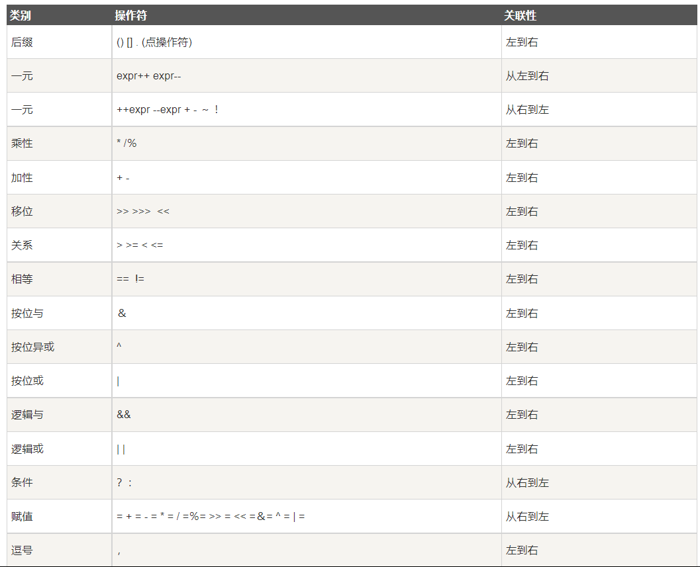

# Java基础课程笔记
韩顺平老师的Java基础课程学习笔记

##  第一阶段

### 第二章 Java概述

#### 就业方向

- 企业级开发 JavaEE 软件工程师
- 大数据
- 安卓开发 安卓软件工程师

#### Java应用 

- **企业**：网页，京东、淘宝、搜狐网站。
- **安卓端**：安卓开发，安卓应用 APP，电视安卓系统
- **嵌入式系统**：机顶盒，总之可以用到 Java          

#### Java版本

Java 8 和 Java 11 为长期支持版，大多数公司使用

#### Java特性

- 面向对象（oop）
- 健壮性——异常处理、垃圾自动收集、强类型机制...
- 跨平台，编译后可在各平台运行（JVM  Java虚拟机）
- 解释性语言，编译后需要解释器才能被机器执行。区别于编译性语言，编译后可直接被执行。

#### 一些概念

- **JavaEE** -> Java Enterprise Edition，Java企业版，用于企业级开发，web应用，也叫 J2EE 

- **JavaSE** -> Java Standard Edition，Java标准版，用于一般Java程序开发（如桌面程序），JavaEE的子集；Java基础 

- **JavaME** -> Java Micro Edition，Java微型版

- **详细解释**：

  - Java SE（Java Platform，Standard Edition）。Java SE 以前称为 J2SE。它允许开发和部署在桌面、服务器、嵌入式环境和实时环境中使用的 Java 应用程序。Java SE 包含了支持 Java Web 服务开发的类，并为 Java Platform，Enterprise Edition（Java EE）提供基础。 

    Java EE（Java Platform，Enterprise Edition）。这个版本以前称为 J2EE。企业版本帮助开发和部署可移植、健壮、可伸缩且安全的服务器端 Java 应用程序。Java EE 是在 Java SE 的基础上构建的，它提供 Web 服务、组件模型、管理和通信 API，可以用来实现企业级的面向服务体系结构（service-oriented architecture，SOA）和 Web 2.0 应用程序。 

    Java ME（Java Platform，Micro Edition）。这个版本以前称为 J2ME。Java ME 为在移动设备和嵌入式设备（比如手机、PDA、电视机顶盒和打印机）上运行的应用程序提供一个健壮且灵活的环境。Java ME 包括灵活的用户界面、健壮的安全模型、许多内置的网络协议以及对可以动态下载的连网和离线应用程序的丰富支持。基于 Java ME 规范的应用程序只需编写一次，就可以用于许多设备，而且可以利用每个设备的本机功能。

- JDK（java development kit  Java开发工具包）：JRE + Java开发工具（javac、javadoc）
- JRE（java runtime environment  Java运行环境）：JVM + java核心类库
- JVM 不同操作系统有不同JVM，从而使得.class 文件能够运行在不同操作系统（跨平台性）

想运行 .class 文件只要有 JRE 就可以

- 文档注释：

``` java
/**
*
*/
```

- 行尾风格、次行风格
- 相对路径：从当前目录（文件夹）开始定位 
  - .\ 当前目录
  - ..\ 上一级目录
  - ..\\..\ 上上一级目录
- 绝对路径：从顶级目录开始定位

#### 一些注意的东西

- 控制台编码默认 ANSI，所以写代码时注意所用的编码，保持编码一致
- 每一个类，在编译时都会产生.class 文件，每个类中都可以有一个main方法
- 转义字符：

```java
System.out.println("老师说："要好好学习"");// 很明显，无法输出，会报错
System.out.println("老师说：\"要好好学习\"");

```

- 回车符含义：把当前光标返回到本行的最开始，并不换行

#### 学习方法

提出需求/要求 -> 考虑现有技术是否能解决？能否完美？ -> 引出、学习新技术 -> 了解基本原理、基本语法 

-> 快速入门 -> 再抠细节、掌握细节 -> 再提需求

### 第三章 变量

#### 数据类型

- 整数值型默认为 int ，若要用 long 类型，需要在数值后加 'l' 或 'L'

- 浮点型默认 double ，若要用 float 类型，需要在数值后加 'f' 或 'F' ，**另外，数值后加 d 或 D 代表数值为double 类型**
  - 浮点数使用陷阱：注意小数运算，比如 2.7 和 8.1/3 ，后者不等于2.7，这是计算机运算的问题，所以，计算后的小数判断相等不可以用 == ，可以做差值，小于某一误差判定相等
  - 字符型必须使用单引号 '' ，不能使用双引号 "" 会报错
  - char 字符类型本质是整数，输出是整数对应的 unicode 码
  - char 类型可以为整数值，可以进行计算

#### 编码

**为什么有编码**？

​		计算机中所有数据在存储，处理时，都是二进制，所以各种 数字、符号、字母 都是用二进制表示，怎么去表示，每个字母、数字、符号用哪个二进制数表示，就是编码的规则要确定的事情。各种编码的存在意义就是为了保证数据的统一，只要使用同一编码规则，数据就不会出错。

**怎么解释韩老师上课说的那个编辑器用 UTF-8 编码，cdm 用 GBK 编码时，程序代码中出现中文会编译出错的情况呢？**

**解释：** 编辑器用 UTF-8 编码，保存之后机器存储这个文件就是用 UTF-8 编码后的二进制数据。当 cmd 进行编译命令，默认使用 GBK 来解释二进制数据，得到的结果就是 UTF-8 编码后的二进制数据用 GBK 编码解释的结果，所以对应的中文会出错，出现乱码。

- unicode 编码包括 ASCII 编码，2个字节，可表示世界上所有语言字符。ASCII则只表示字母、符号、数字，1个字节
- utf-8 为变长编码，可用1~6个字节表示符号，字母占1个字节，汉字占3个字节
- **一个小问题**：sublime 里的保存编码，文件编码，重新打开编码是什么意思？

#### 数据类型转换

- **自动类型转换**：进行赋值或者运算时容量（精度）小的自动转换成容量（精度）大的数据类型
  - char --> int --> long --> float --> double
  - byte --> short --> int --> long --> float --> double
  - 进行运算时，会将所有数据转换成目前容量（精度）最大的数据类型，最终结果也是该类型
  - char 和 （byte、short）之间不能进行自动类型转换

``` java
	byte num = 1;
	char ch = num;//错误，不能进行自动类型转换
```

- - 把具体数赋值给 byte、short、char 时，编译器先判定最后的值是否在定义类型的范围内，在范围内就可赋值

``` java
	byte num = 10;//此处，具体数赋值，10默认为int类型，按理说不能这样把int给byte，但10在byte范围内，所以可以
	int num2 = 1;
	num = num2;//错误，变量赋值，判断类型，int不能赋给byte，另一个角度，从内存上解释
	
	char ch1 = 'a' + 1;//具体数赋值，可以，为'b'
```

- - byte、char、short 三者之间，或和本类型之间进行运算，都会先转换成 int 再运算，所以结果都是 int 类型

```java
	byte n1 = 1;
	byte n2 = 2;
	byte n3 = n1 + n2;//错误，结果为int类型
	char c1 = 'a';
	char c3 = c1 + n1;//错误，结果为int类型
```

- - 布尔型 boolean 不参与类型自动转换

- **强制类型转换**：可能会造成数据精度损失或溢出

  - 强转只对最近的操作数有效

    ``` java
    int = (int)1.9 + 13.1;//只对1.9进行强制转换
    int = (int)(1.9 + 13.1);//一般用单括号提升优先级
    ```
  
- String 和基本数据类型的转换

  - 基本 -> String ：基本类型 + "" 即可

  - String -> 基本 ：调用对应基本类型的包装类中的 parse 方法

    ``` java
     int i1 = Integer.parseInt("10");
     float f1 = Float.parseFloat("12.3");
     string str1 = "123"; 
     char c1 = str1.charAt(0);//对于char，用charAt(0)得到第一个字符
     //...
    ```

  - String 转换成错误类型会出异常，比如"hello"转换成整数报异常

### 第四章 运算符

- 关于取余运算 % ，取余实际上是公式 **a % b = a - (int)(a / b) * b** 得来的，所以如下一些计算都可得到

  ```java
  System.out.println(10 % 3);//1
  System.out.println(-10 % 3);//-1
  System.out.println(10 % -3);//1
  ```

- 开发中不要用 a、b、n1 来命名

- 逻辑与 && 、逻辑或 || 和位运算与 &、位运算或 | 的区别

  逻辑符号只能对 boolean 类型做运算，并且有短路现象；而位运算符可对所有数据做运算

- 移位运算符 >>  <<  >>> 

  - \<< : 左移，低位补 0
  - \>> : 有符号右移，高位补符号位值，即正数补 0 ，负数补 1 
  - \>>>: 无符号右移，无论正负，都补0
  
  **优先级**
  
  

#### 标识符规范

- 标识符规则（必须遵守）：
  - 组成：26 个字母，数字 0~9 和  "_"  "$"	 两个符号
  - 数字不可开头
  - 不可与关键字和保留字相同
  - 严格区分大小写
  - 不能包含空格
- 标识符规范
  - 类名、接口名：多单词组成时，所有单词首字母大写
  - 变量名、方法名：多单词时，第一个单词小写，之后单词首字母大写
  - 常量名：所有字母大写，多单词间用 _ 间隔
  - 包名：多单词组成时所有字母都小写
- 保留字：之后可能会被用到作为关键字，比如 goto...

#### 杂

- 获取用户输入方法：引入Scanner类，之后调用其中方法

- 进制：

  ``` java
  int n1 = 0b0010;//二进制用ob或oB开头
  int	n2 = 01011;//八进制用0开头
  int n3 = 0x0001;//十六进制用0x或0X开头
  ```

- **原码、反码、补码**

  - 正数三码合一
  - 负数反码为原码符号位不变，其他取反
  - 负数补码为反码 + 1 ，即反码为补码 - 1
  - 0 的补码、反码都是 0
  - java 中所有书都是有符号数，**计算机计算时都按补码，结果要看原码**（每个补码与原码都是一一对应的，因为补码与原码相加等于模值）

  **补码的作用**就是统一加减法，将减法用补码加法运算表示。比如 1 - 2 就变为 1 + (-2) ，所有减法都看做负数补码与其他数的补码相加，所以免除了计算机中的减法，大大节省一些成本（不需要减法器，全部用加法器）

### 第五章 结构控制

循环是重点，本章包含了编程思想

- 多分支 只有一个入口，只会执行一段代码（或者没有else ，则可能没有入口）

```  java
	if(条件表达式){
	
	}else if(条件表达式){
	
	}...
	
	else{//可以省略
	
	}
```

- switch 

  - 一个点要记得，如果有 case 中代码被执行，没有 break 语句，那么它会继续执行下一个 case/default 中的代码（**穿透**）

  - 表达式的数据类型与 case 中**常量**（不可以是变量）的数据类型要一致，或者能够自动转换（相互转换）

  - 表达式中的值必须是 char、byte、short、int、enum[枚举]、String 类型

  - 可以没有 default  

  - **一个记录：**

    要判断范围，比如老师讲的练习，大于 60 合格 小于 60 不合格，可以用分数除以 60 ，大于就等于 1 ，小于就等于 0  （不能用 boolean ，因为 switch 里变量不能用 boolean）

- switch 与 if 比较

  - 当取值个数较少，且数据类型在 char、byte、short、int、enum、String 之中，建议用 switch
  - 当判断范围，或者取值为 boolean 类型，建议用 if

- for 循环

  - 循环条件一定是一个 boolean 类型的值

  - 变量初始化和变量迭代可以写在其他地方，但两边分号不可省略

    ```java
    int i = 0;
    for(; i <= 10;){
        System.out.println("ok" + i);
        i++;
    }
    ```

  - 可以初始化多个变量，要求类型一样且中间需要用逗号分隔，迭代也可迭代多个变量，中间用逗号分隔

- **两个编程思想：**

  ```java
  //需求：打印1~100中9的倍数的整数，统计个数及总和
  //实现：
  int num = 0,sum = 0;
  for(int i = 1; i <= 100; i++){
      if(i % 9 == 0){
          System.out.println("i="+i);
          num++;
          sum += i;
      }
  } 
  System.out.println("num=" + num + " sum=" + sum);
  ```

  
  - **化繁为简**

    把复杂需求拆解为简单需求

    1. 打印 1~100 的值

    2. 打印被 9 整除的数（i % 9 == 0）

    3. 记录被 9 整除数的个数（用一个变量记录 int num）

    4. 记录所有被 9 整除数的总和 （用一个变量记录 int sum）

  - **先死后活**

    把固定需求变为灵活需求（定值变为变量）

    1. 需求为 1~100 ，起始值和终止值都可以用变量代替，以满足起始值、终止值变化的需求

    2. 记录的是被 9 整除数，可以用变量代替，满足被其他数整除的需求

- while 循环与 for 类似，只不过形式不同，流程相同

- do-while

  - 先变量初始化，再执行，再判断循环条件，所以一定会执行一次

  ```java
  变量初始化
  do{
  	循环体
  	变量迭代
  }while(循环条件);//注意这个分号
  
  ```


**现在需要想一些东西我应该怎么去学**？

一种是快速过，过知识点，回头巩固知识，做练习；另一种是一步一步慢慢来，学一个就把握一个，尽可能把每个都把握牢固。在学校学习其实就有这方面的一些选择，学一门学科，刚开始就得确定之后应该怎么去学，是第一种还是第二种。

第一种可能更快获得心里的满足，但并不长久，虽然进度快，但是内核比较不稳固，之后可能会有学了的都忘了的感觉。

第二种过程可能慢不少，但每一个知识点都比较牢固，以后不容易出现心慌的感觉

总之都得是经过两个过程，一个是知识点学习，另一个是练习。都缺一不可，一个决定进度和广度，另一个决定深度和精度。

- 多重循环是重点，这里练习了不少
- equals比较字符串内容，==比较地址值

- break 直接结束该循环

  - 标签的使用（开发尽量不要使用）

    ```java
    label1:for(;;){
    	label2:for(;;){
    		break label1;//退出label1代码块
    	}
    }
    ```

- continue 结束本次循环，开始下一次循环

  - 标签的使用（开发尽量不要使用）

    ```java
    label1:for(;;){
    	label2:for(;;){
    		continue label1;//进入label1下一次循环
    	}
    }
    ```

- return 结束方法，如果在 main 方法中则程序结束（一个完整程序应该是什么样的？只有一个 main 方法？）

### 第六章 数组、排序和查找

#### 数组

存放同一类型的数据，是一种数据类型，是引用类型

[] 可以放在数据类型后，也可放在变量名后

某类型数组内部元素赋值与该类型变量赋值规则相同（自动类型转换）

```java
for ( int i = 0; i < abcArray.length; i++){}//遍历数组的写法 i < 数组名.length
```

- 动态初始化

  两种方式：

  1. 数据类型[] 数据名 = new 数据类型[数据个数];

  ```java
  double[] hens = new double[5];//double类型hens数组，存放5只鸡
  ```

  2. 先声明，再分配空间

     即先 数据类型[] 数据名; 再 数据名 = new 数据类型[数据个数];

  ```java
  double[] hens;//先声明
  hens = new double[5];//再分配空间
  ```

- 静态初始化

  即一开始就定好每个元素

  ```java
  double[] hens = {3.2,5.6,3.0,8.8,50};//五只鸡
  //等价于下面
  double[] hens = new double[5];
  hens[0] = 3.2;hens[1] = 5.6;hens[2] = 3.0;hens[3] = 8.8;hens[4] = 50;
  ```

- 数组为引用类型，所以赋值时为引用传递（区别于值传递）

  ```java
  int[] nums1 = {1,2,3};
  		int[] nums2 = nums1;
  
  		nums1[0] = 2;
  		System.out.println("nums2[0]的值为：" + nums2[0]);//2
  ```

  解释用到了 JVM 栈、堆内存图

   

  这里我理解的是， = 号的效果都是值拷贝，只不过引用类型在栈中存的是地址，是地址的拷贝，但地址中数据改变，所有存着该地址的引用类型变量都会变。

- 如何拷贝数组的值？

  用 new 就会开辟一个新的地址空间，new 变量类型[待拷贝变量名.length]，再用 for 遍历一遍赋值集合

- 如何翻转数组的值？

  1. 数值交换，用临时变量，前后交换 array.length / 2 次
  2. 定义一个新数组，将原数组逆序遍历，赋值给新数组，再将新数组的地址赋给原数组（这样原数组就翻转了，原来的地址空间数据就被废弃，新的地址空间数据有两个变量使用）

- 数组扩容

  定义新数组，长度加一，原数组拷贝，新数据赋给新数组最后一位，最后把元素组指向新数组地址

#### 冒泡排序

#### 查找 

- 一个编程思想

  index = -1; 当查找到数据，改变 index ，没找到，则 index 没变，最后判断 index 是否变化来看是否找到

#### 二维数组

一维数组中每个元素都是数组

定义需要 2 个 []

[]\[] 可以放在数据类型后，也可放在变量名后，**还可以有一种方法，比如 int[] array[]; 也可以**

遍历需要两层循环

``` java
int[][] array= {{1,0,0,0,0},
				{0,1,0,0,0},
				{0,0,1,0,0},
				{0,0,0,1,0},
				{0,0,0,0,1}};
		for ( int i = 0; i < array.length; i++) {
			for ( int j = 0; j < array[i].length; j++) {
				System.out.print(array[i][j] + " ");
			}
			System.out.println("");
		}
```

- **动态初始化**

  **三种方式**：

  1. 数据类型[]\[] 数据名 = new 数据类型[**内部数组**个数]\[**内部数组**数据个数];

  2. 先声明，再定义

  3. 列数不定（内部数组数据个数不定）数据类型[]\[] 数据名 = new 数据类型[**内部数组**个数]\[];

     ```java
     int[][] arr = new int[2][];//行数为2，列数不定（数组中包含两个数组元素，它们的元素个数不定）
     ```

     **此时内存中状况**：（所以还需要给每个内部数组开辟空间  new）

       

- 静态初始化（定义时内部值就已经确定）

二维数组的内存结构（数组里存的东西都是地址，没有直接存数据）

 


另外一种数组的定义方式：（这个叫做匿名数组，老韩提了一嘴，用于给数组引用赋新值，Java 核心卷中学到的）

```java
int[] array1 = new int[]{1,2,2,4};//一维数组
int[][] array2 = new int[][]{{1,2},{2},{4}};//二维数组
```

ArrayHomework04 写了很长时间，值得思考，老韩的两个方法更好，我的一个方法更好

写代码，边想边写，写完了感觉自己都不确定对不对 =.= 先想好在写是不是好点

### 第七章 面向对象编程(基础部分)

#### 类与对象

- 对象的引出：现有技术无法解决（很好、完美解决）新的需求。比如说，两只小猫的基本信息，用变量或者用数组记录太麻烦，有很多问题
- 类是一种自定义的数据类型，猫类、狗类、人类
- 对象是一个类的具体实例，比如人类里的宫郑...

##### 对象在内存中的存在形式

- 对象是引用类型，所以栈中存放地址，指向堆，堆中包含对象中的数据，如果数据为 String 类型（用常量赋值），为引用类型，同样存放地址，指向常量池。
- 当 new 一个对象时，会加载类的信息。

 

- **成员变量（属性）**

  - 成员变量定义：访问修饰符 数据类型 属性名;
  - 成员变量有默认值（与数组一样）

- 创建对象两种方法

  1. 先声明再 new
  2. 直接 new 赋值

- 对象的赋值，和数组一样，引用传递，将地址赋给其他变量

  ```java
  Person person1 = new Person();
  person.name = "小明";
  person.age = 12;
  Person person2 = person1;
  System.out.println("person2.age=" +　person2.age);//为12
  ```

##### 对象创建流程

```java
Person person = new Person();
person.age = 12;
person.name = "小明";
```

1. 先初始化类信息（属性、方法，只加载一次）
2. 在堆中分配空间，初始化属性值（默认值）
3. 把堆中空间的地址赋给栈中变量
4. 为对象属性赋值

#### 成员方法

方法定义：

```Java
访问修饰符 返回类型 方法名 (形参列表){
	代码
	方法体
}
```

方法调用流程！！

每次调用方法都会在栈中开辟一个独立的方法空间，执行方法里面的代码，return 后返回调用方法的地方，栈空间销毁

- 方法的好处：实现代码复用，每次使用同一方法，达到同样效果，只需要调用即可

- 方法细节：
  - 返回类型
    - 如果要求有返回数据类型，则必须有 return ，且返回的类型一定与要求的一致或兼容（满足自动类型转换）
    - void 不需要 return 
  - 形参列表
    - 传参时类型要一致或兼容（满足自动类型转换），顺序要一致
  - 方法体
    - 方法不能嵌套定义
  - 方法调用细节
    - 同一个类中的方法可以直接调用
    - 跨类的方法调用需要用对象名（后面提到访问修饰符会细说 ）

##### 方法的传参机制

值传递与引用传递的区别

#### 方法的递归（练习没做插个旗 flag）

```java
public void test(int n){//当传入参数为4，输出什么？画内存图可以很好解释过程
	if(n > 2){
		test(n - 1);
	}
	System.out.println("n=" + n);
}
public void test(int n){//当传入参数为4，与上面有什么区别？
	if(n > 2){
		test(n - 1);
	}else{
        System.out.println("n=" + n);
    }
}
```

递归，每次递归一定是在向退出递归的条件靠近，否则就会无限循环，报 StackOverflowErr ，死龟了:)

#### 方法重载

允许同名方法存在，但要求它们的参数列表不同

**例子**：System.out.println 中，System 是一个类，out 是它的属性，这个属性是一个 PrintStream 对象，其中有println 方法，这个方法的形参列表有很多不同类型，String、int、char、short、byte······

##### 好处

1. 避免起名麻烦
2. 避免记名麻烦
3. **有利于接口编程**（后续会说）

##### 要求

1. **方法名必须相同**
2. **形参列表必须不同**（数据类型或顺序或个数不同）
3. 返回类型无要求（返回类型不同不影响构成重载）
4. 修饰符无要求


#### 可变参数

```java
public int sum(int... nums){//nums为可变参数，本质是一个数组，这样解决了求2个数、3个数、4个数...这种需求，不需要多次重载一个方法
		int res = 0;
		for ( int i = 0; i < nums.length; i++) {
			res += nums[i];
		}
		return res;
}

```

细节：

1. 可变参数的实参可以是一个数组（上例中，调用该方法时直接传入一个数组，那 nums 就指向了该数组）
2. 可变参数可以和普通类型的形参一起存在于形参列表，但它只能在最后的位置（一个形参列表只能有一个可变参数）


**一个注意的点：一个 .java 文件中只能存在一个 public 修饰的类，且 public 修饰的类必须和文件名相同（区分大小写）**

#### 作用域

- 属性（成员变量）和数组一样，有默认值，可以不赋值直接使用，但局部变量没有默认值，必须先赋值再使用
- 属性（成员变量）和局部变量可以重名，使用时遵守就近原则
- 在同一个作用域的变量，变量名不可以重复
- 属性的生命周期伴随对象创建和销毁，而局部变量伴随它局部的作用域创建和销毁
- 属性可以加修饰符，局部变量不可以

#### 构造方法 / 构造器

构造器用途：为一个具体对象的属性赋值，将对象初始化（满足刚创建对象后就有属性值，不需要再赋值）

构造器定义：

```java
[修饰符] 方法名(形参列表){//修饰符可以为默认值
	方法体;
}
```

- 构造方法没有返回值（无需返回类型）
- 方法名必须和类名相同
- 形参列表和方法有相同规则
- 构造方法由系统自动调用，在创建对象时调用

```java
public Pig(String name,int age){//完成初始化赋值
		this.name = name;
		this.age = age;
	}
public Pig(String pName,int pAge){//这种方式的赋值原来没见过
		name = pName;
		age = pAge;
	}
```

- 一个类可以定义多个构造器，即构造器的重载（比如只赋值一部分属性，另一部分不赋值）

- 如果没有定义构造器，默认有一个无参构造器
- 如果定义了构造器，无参构造器就不存在了，除非显式定义

#### 对象创建流程

 

1. 首先加载类信息
2. 再开辟空间
3. 再为属性初始化，这里分三步
   1. 默认初始化：将值赋值为默认值
   2. 显式初始化：执行成员变量定义处的赋值语句
   3. 构造器初始化：调用构造方法初始化
4. 将对象的地址赋给变量

#### this 关键字

谁调用了这个方法，这个 this 就代表谁

可以这样理解，每一个对象创建好后，它空间内部隐藏了一个 this 变量，这个变量存储的值就是这个对象的地址值

 

##### **this 注意事项与使用细节**

- this 可以用来调用对象的属性、方法、构造器
- 要用 this 调用构造器，必须要在构造器中，并且一定得是构造器的第一个语句，其形式为 this(形参列表);
- this 不能在类定义的外部使用，只能在类定义的方法中使用

#### 本章作业

10、

```
i=101
j=100
101
101
```

**代码健壮性问题**

定义一个类，内含一个方法 max 用来找到 double 数组最大的元素值

1. 如果给的数组长度为 0 怎么办（array = {}）？
2. 如果数组 array = null 怎么办？

```java
public Double max(double[] array){//返回类型为Double类对象，解决了数组无最大值时返回值的不合理的问题
		if(array != null && array.length > 0){//array != null解决 array为null的问题；array.length > 0解决 array = {}的问题
			double max = array[0];
			for(int i = 0; i < array.length; i++){
				if(array[i] > max){
					max = array[i];
				}
			}
			return max;
		}
		return null;
	}
```

**匿名对象**

new 类名(); 这样的对象没有变量名去引用，称之为匿名对象，使用完后就会被销毁

**圆周率的表示方式**

Math.PI

### 第八章 面向对象编程（中级）

#### IDEA使用

- 代码字体、UI 字体、颜色、文件编码

- 快捷键

  - 删除当前行
  - //行注释，/**/注释
  - 复制当前行

   

 

- 模板（比如 sout ）、如何设置模板 settings -> editor -> live template
- surround with 快捷键 ctrl + alt + T
- 显示所有模板的快捷键 ctrl + j

#### 包

##### **三大作用**

- 用于区别相同名字的类
- 方便管理大量不同功能类别的类
- 用于控制访问范围

**基本语法**

package com.gongzheng;

package 关键字表示打包

##### **包的本质**

文件夹、目录，用于存放不同的类、接口


- 不能引入相同名字的类

```java
import com.gongzheng.Dog;
import com.gz.Dog;//错误，引入的类名不能相同
```

- 一种区分相同类名的方法

```java
import com.gongzheng.Dog;

public static void main(String[] args) {
    
    Dog dog = new Dog();//这个指的是来自com.gongzheng的Dog类
    com.gz.Dog dog = new com.gz.Dog();//这个明确指明用的是com.gz中的Dog类
}
```

**包的命名规则**：包名只能包含数字、字母、下划线、小圆点，且不能以数字开头，不能是保留字或关键字

**包的命名规范**：com.公司名.项目名.业务模块名

**包的细节**

- 引包（导包）的方式：

  比如，java.util.Scanner; 表示引用 java.util 中的 Scanner 类；

  或者 java.util.*; 表示引用 java.util 中的所有类

  建议使用上面的方式，更加具体

- package 语句只能在一个类文件的最上面

   

- import 语句位置放在 package 和类声明语句之间，可以有多条，没有顺序要求

#### 访问修饰符

用于修饰类、类属性和方法。其中类只能用 **public** 或 **默认** 两种来修饰

**种类**：

**public**：所有类都可以使用（同类、同包、子类、不同包）

**protected**：子类和同包、同类可使用（同类、同包、子类）

**默认**：同包、同类可使用（同类、同包）

**private**：只有本类可使用（同类）

##### 关于 protected 修饰符的体会心得：

父类中可以直接使用子类继承自自己的 **protected** 属性，不能使用继承自自己的 **默认的** 属性，不能使用子类特有的 **protected** 属性（父类与子类不同包）

protected 修饰的成员，一般不能跨包使用。要跨包使用，那么被使用的那个 protected 成员一定来自一个父类的子类，而且使用这个成员的类一定与这个子类的父类同包（相当于间接跨包，但其实本质上没有跨包，因为使用成员的类和父类同包，但只是用子类调用，子类与本类不同包）

如图

  

这里用了 5 个类去测试 protected 属性的使用，test 包中 Test 类有 protected 属性 name ，被 ProtectedTest 类继承，在其他 3 个类中调用子类继承的 name 属性，只有 Try 类中没有报错，另外两个都会报错，无法访问。印证了上面的说法，要跨包使用 protected 属性（其实实质上没有跨包，只是看上去与子类是跨包的），这个属性一定继承自一个同包的父类中，否则无法使用。也就是说，与父类不同包，就无法使用其中的 protected 方法，例如图中两个报错的类。（**使用地必须与被使用的 protected 属性同包，可以与继承了该属性的子类不同包。或者，使用地在子类中**（这时对于静态属性可以用子类或父类类名调用，对于非静态，只能用子类对象调用））

**最后的总结**：看**使用地**与**父类**、**子类**的关系即可（这里还差了在子类中使用的情况）


可参见：[Java protected 关键字详解 | 菜鸟教程 (runoob.com)](https://www.runoob.com/w3cnote/java-protected-keyword-detailed-explanation.html)

**最后的总结**：对于 protected 修饰的属性，使用地只能是同包，或者是子类中。在子类中只能通过子类实例使用。（静态情况仍需总结，在子类中，属性可以用父类名访问，但方法却不可以）

**子类对象可以访问使用继承自父类中的属性和方法**（这个其实对应上图的第三种情况）


**问题**：

什么叫做，在本类中访问、同包中访问、子类中访问、不同包中访问？

为什么需要访问修饰符？

#### 封装

封装就是把抽象出的数据（属性）和操作数据的操作（方法）封装在一起，数据被保护在内部，程序的其他部分只能通过被授权的操作（方法）去对数据进行操作

**高内聚，低耦合**：类内部的数据自己处理，无需外界干涉；仅对外暴露少量方法。


**问题**：

这里不是很明了，封装究竟是为了什么？意义何在？老韩所说的隐藏实现细节，直接调用即可，那我不封装不行吗？方法都是直接调用的，细节不都是隐藏的吗？第二点说对数据进行操作，那数据就一定得是 private 修饰吗？不是 private 修饰不也能调用 get 和 set 方法来操作吗？


- String 类型有 length 方法，获取字符串长度

- 构造器与 setXxx 方法结合，而不是用传统的 this.属性名 = 值; 这样就能将封装用在构造器中


**问题：什么时候需要用 import ?** 

当所创建对象是不同的包中的类，这时就需要引包了

##### **问题：访问修饰符和封装的意义究竟是什么？**

**问题：为什么要有访问修饰符？**

**问题：class 被 public 修饰和默认有什么区别？访问权限不同，有什么用吗？**

感觉封装和访问修饰符意义很相关。private 这一修饰符和封装的使用有很大关系

#### 继承

**意义**：比如现在有两个类，小学生类和大学生类，它们的属性和方法几乎一样，每次多一类学生，我们就要重复地去写相同的代码，这样的代码复用性很差，重复性很高。所以，有了继承，提高代码复用性。

 

**结构图**

  

- 子类会自动拥有父类的属性和方法
- 父类又叫 超类、基类
- 子类又叫 派生类

**问题：如何获取父类中的属性？**

继承后可以直接使用父类属性，私有属性需要调用公共方法才能获取

**问题：构造器能否被继承？**

构造器不会被继承，但是子类的构造器必定会调用父类构造器（默认调用无参构造器，如果没有，则需要用 super 指明调用哪个父类构造器）

继承的好处：

- 提高代码复用性
- 提高代码扩展性和维护性

**继承的细节**：

- 父类中非私有的方法和属性可以被子类直接访问，但私有方法或属性不能被直接访问，需要通过父类的公共方法才能访问（比如私有的属性 age ，就可以调用父类中公共的 getAge() 方法来访问，私有的方法 test() 可以通过父类中公共的 callTest() 方法来调用）
- 子类必须调用父类构造器，完成父类初始化
- 无论使用子类的哪个构造器，总会默认调用父类的无参构造器，如果父类没有无参构造器，则必须指定（使用super() ）使用父类的一个构造器，否则报错（super() 和 this() 一样，必须位于构造器的第一个语句）
- super() 只能在构造器中使用（这和 this 一样，this() 只能在构造器中使用）
- Object 类是所有类的父类
- 构造器调用不仅局限于直接父类，父类同样也会调用其父类的构造方法，一直追溯到 Object 类
- Java 中是单继承机制，每个类只能直接继承一个父类（想继承多个，得让子类的父类继承父类的父类）
- 父类和子类之间必须满足 is-a 的关系，比如，Student is a Person，这样继承才合理

**问题：为什么子类的构造器一定会调用父类的构造器？为什么要用 this 调用自己的构造器？有什么用？（这里 this 调用本类构造器可能是为了实现代码复用吧，不用重复赋值）**

调用父类构造器也是为了为父类属性赋值。如果不调用父类构造器，那父类属性就不会被初始化，那该怎么去改变父类属性的值呢？set 方法，但是一个一个 set 不就非常麻烦嘛，构造器存在就是为了给属性赋初值，那就调用父类然后赋初值就好。

##### 继承的本质！！

**当执行`Son son = new Son();`这段代码，内存中发生什么？**

- 当 new 了一个 Son 对象，内存中首先加载类信息
- 先**从最上级的父类开始加载，一直往下加载到 Son 类**
- 然后开辟 Son 对象的空间，其**内部存在所有父类的属性和值**
- 最后将 Son 对象的地址赋给 son 变量

 

这时，访问 son 对象的属性，满足查找规则，即从子类开始往上面查找，找到属性，且可以访问，就返回这个属性值。如果不可以访问，那么必须调用含有该私有属性的类的公共方法才能访问

##### **查找规则！！**

 


```java
public Computer(String cpu, String ram, String hardDisk) {//Pc的父类
        setCpu(cpu);
        setRam(ram);
        setHardDisk(hardDisk);
}

public Pc(String brand,String cpu,String ram,String hardDisk){//NotePad的父类
        super(cpu,ram,hardDisk);
        setBrand(brand);
}

public NotePad(String color,String brand,String cpu,String ram,String hardDisk){
        super(brand,cpu,ram,hardDisk);
        setColor(color);
}
```

**这里体现了继承的一个思想**：父类属性由父类构造器完成初始化，而子类属性由子类构造器完成初始化

#### super 关键字

用来访问父类的属性、方法、构造器，其中私有的无法直接访问

##### **好处**

- 可以调用父类构造器，使得分工明确，父类构造器初始化父类属性，子类构造器初始化子类属性
- 当父类属性与子类属性重名，可以用 super 来调用父类属性/方法（相当于从父类开始查找规则），解决重名问题（如果没有重名，那么使用 super、this、直接访问，都是一样的效果，即使用父类属性/方法）

**问题：子类中方法与父类方法相同，那算是重写吗？**

是的，只要方法名、形参相同，就构成重写了

 

#### 方法重写/覆盖（override）

子类方法和父类方法的名称、返回类型、形参一样，则构成重写/覆盖（override）

##### **重写细节**

- 重写方法的名称、形参必须和父类被重写方法一致
- 返回类型必须一致或者是被重写方法返回类型的**子类**（比如父类方法返回类型为 Object ，重写方法的返回类型为 String ）
- 子类方法不能缩小父类方法的访问权限（不能由 public -> protected，可以扩大）

只要子类方法和父类方法名称、形参一致，就构成重写了（形参不一致，是重载，名称不一致，是不同的方法），就必须要求返回类型得是父类返回类型的子类（或一致），且必须要求子类方法访问权限不能缩小

##### **重写的一种技巧**

```java
public String say(){//父类的方法
	return "大家好，我叫" + name + "，今年" + age +"岁了！";
}

public String say(){//子类重写的方法
	return "大家好，我叫" + this.getName() + "，今年" + this.getAge() +
    		"岁了，我的id是" + this.id + "，我的分数是" + this.score;
}
  
public String say(){//这种方式写，复用了父类的代码，更加巧妙
	return super.say() + "我的id是" + this.id + "，我的分数是" + this.score;
}
```

#### 多态！！

动物喂食的问题：代码复用性不高，每出现一种动物，它们吃的东西不一样，feed 方法都要重载一次，不利于代码维护和管理

引出多态：提高代码复用性，解决问题

##### 多态的具体体现

- 方法的多态

  方法的重载和重写就体现出多态。比如一个方法 sum() ，构成重载，调用 sum 方法，传入参数不同，方法执行过程不相同，这就是重载体现出来的 **多种形态** 。而重写也是同样的道理，B 类继承 A 类，它们都有say 方法，B 中 say 方法构成重写，那么创建不同对象，调用 say 方法也会有不同的执行过程，这就是重写体现的 **多种形态**。

- **对象的多态**（**核心、关键**）

  1. 对象可以分为编译类型和运行类型

  2. 编译类型定义了，就确定了，不能改变

  3. 运行类型可以改变

  4. 编译类型看 = 左边，运行类型看 = 右边

  ```java
  Animal animal = new Cat();//animal的编译类型为Animal类，运行类型为Cat类
  animal = new Dog();//运行类型变为Dog类，可以改变，但编译类型不变
  ```

  **调用方法时，实际上要看运行类型？**

  对，调用时还是满足查找规则，从运行类型的类开始查找，如果有，可访问，就调用

  - **向上转型**

    父类类型引用子类对象，就是向上转型。相当于子类对象被提了一个档次，所以叫向上转型

    例：`Animal animal = new Cat();`

    **向上转型调用成员的规则如下**：

    1. 可以访问/调用父类中的所有成员（遵守访问修饰符规则）

    2. 子类中特有的方法无法调用，子类的属性无法访问

       **这两个规则的原因在于**：编译时只看编译类型，所以编译器只能判定父类中的成员是可用的，但无法知道运行类型中的成员

    3. 运行时从运行类型的类开始进行查找规则（**而且，子类成员需要满足重写才能被查找到，属性没有重写一说，所以只能查找到父类中的属性**），因为运行时看运行类型，即从子类开始查找，当然这时只能查找到编译通过的成员，特有的成员则无法访问 

       所以这时，如果子类中重写了父类的方法，从子类开始查找，就会调用子类重写的方法

  - **向下转型**

    向下转型语法：子类类型 引用名 = (子类类型) 父类引用;

    例：`Cat cat = (Cat) animal;`

    向下转型规则：

    1. 只能强转父类引用，不能强转父类对象

       例：`Cat cat = (Cat) (new Animal());`运行时将报异常

    2. 父类引用原来指向的必须是目标类型的对象（即不能把指向 Dog 类的父类引用转换为 Cat 类型，会报异常）

    3. 下转型后，可以调用子类的所有成员

  - 属性没有重写一说，调用要看编译类型，**从编译类型开始向上查找**

##### instanceOf 比较操作符

用于判断对象的**运行类型**是否为 XX 类型或者 XX 类型的子类型（间接子类型也满足）

##### 做题总结：对象调用方法或者属性时，分别从运行类型和编译类型开始向上查找 ！！！

**问题**：

**多态中 this 和 super 的使用是否有变化？**

没有，this 和 super 都是在方法体中使用的，而方法调用是调用运行类型中的方法，从运行类型中开始向上查找。this 在那个方法里就代表那个方法的类，super 同理。相当于父类引用代表的就是子类类型，**所以 this 就是指子类，就是运行类型。**

##### 动态绑定机制（非常非常重要！！）

   

1. 如果把 B 中的 sum 方法注销，输出什么？

   这里，注销了 B 中的 sum 方法，之后调用的是 A 类中的 sum 方法，但是这里会调用一个 getI 方法，它指的是 A 类中的还是 B 类中的？这里将老韩说的动态绑定机制理解为，调用方法在子类中没找到，父类中找到了，父类的这个方法中再次调用一个方法，这时还是会返回到子类中开始查找。但是对于属性，它不会从子类开始查找，直接取决于作用域。

2. 如果把 B 中的 sum1 方法注销，输出什么？

```java
A a = new B();
System.out.println(a.sum());//40 注销B中sum -> 30 再注销B中getI -> 20
System.out.println(a.sum1());//30 注销B中sum1 -> 20
B b = new B();
System.out.println(b.sum());//40 注销B中sum -> 30 再注销B中getI -> 20
```

##### 多态数组

```java
Person[] person = new Person[3];
person[0] = new Person("jack",12);
person[1] = new Student("mike",12,66);
person[2] = new Teacher("scott",12,28000);
//用for循环遍历数组，调用每一个元素的say方法
//用instanceOf判定，如果是Student或者Teacher类则调用特有的方法
```

##### 多态参数

```java
Worker worker = new Worker("小郑", 9000);
Manager manager = new Manager("小宫", 20000, 10000);
Employee none = new Employee("无名氏", 1000);
PolyParameter polyParameter = new PolyParameter();
System.out.println("小郑的年薪为 " + polyParameter.showEmpAnnual(worker));
System.out.println("小宫的年薪为 " + polyParameter.showEmpAnnual(manager));
polyParameter.testWork(worker);
polyParameter.testWork(manager);
polyParameter.testWork(none);
public double showEmpAnnual(Employee e){//多态参数，可接受所有其子类型的参数，然后可以执行子类中重写的方法，非常方便
	return e.getAnnual();
}
public void testWork(Employee e) {//instanceOf + 向下转型，可以调用子类特有方法
	if(e instanceof Worker){
    	((Worker) e).work();
	}else if(e instanceof Manager){
    	((Manager) e).manage();
    }else {
    	System.out.println("这是个员工，他在干活...");
    }
}
```

 

#### Object类


##### equals 方法

```java
public boolean equals(Object anObject) {//String类中重写的equals方法，可以读一读当练习
        if (this == anObject) {
            return true;
        }
        if (anObject instanceof String) {
            String anotherString = (String)anObject;
            int n = value.length;
            if (n == anotherString.value.length) {
                char v1[] = value;
                char v2[] = anotherString.value;
                int i = 0;
                while (n-- != 0) {
                    if (v1[i] != v2[i])
                        return false;
                    i++;
                }
                return true;
            }
        }
        return false;
    }
```

**问题：**

this.name 和 name 它们的含义是否一致？

比如在上面 String 重写的 equals 方法中的 value ，如果替换成 this.value 含义其实是一样的，它们都代表从当前类开始向上查找属性 value

Person 类重写 equals 方法

``` java
public boolean equals(Object obj){
        if(obj == this) {//如果是同一个对象，返回true
            return true;
        }
        if (obj instanceof Person){//不是同一个对象，如果是Person类，则比较各个属性
            Person objPerson = (Person) obj;
            return name.equals(objPerson.name) && (age == objPerson.age) && sex.equals(objPerson.sex);
        }
        //不是同一个对象，且不是Person类，返回false
        return false;
    }
```

- 一个注意的点：== 如果比较的**不是同一类型或者引用类型与基本数据类型比较或者没有继承关系**会直接编译报错	

##### hashCode 方法

**几个结论**：

- 可以提高具有哈希结构的容器的效率
- 哈希值主要根据地址值得来，但它们不是等价的
- 如果引用指向同一个对象，则哈希值相同（因为地址值相同）
- 如果引用不指向同一个对象，则哈希值不同（因为地址值不同）
- 在集合中将在需要的时候重写 hashCode 方法

##### toString 方法

默认返回：全类名（包名.类名）+ "@" + 哈希值的十六进制

- 重写后，一般用于返回对象的属性值
- 直接输出对象，会默认调用这个对象的 toString 方法

##### finalize 方法

当对象被回收时，系统自动调用 finalize 方法，子类可以重写该方法，用于释放资源的操作

- 什么时候对象被回收：当对象没有任何引用，jvm 就会认为这是一个垃圾对象，会使用垃圾回收机制销毁该对象，在销毁前将调用 finalize 方法（什么时候调用回收机制取决于 gc 算法）
- 可以主动调用 System.gc(); 来触发垃圾回收机制
- 实际开发中几乎不会用到

##### 断点调试

IDEA 快捷操作：

- F8 执行下一行
- F7 跳入方法
- Shift + F8 跳出方法
- F9 执行下一个断点

小技巧：

1. 光标放在变量上可以查看变量信息
2. Debug 执行过程中可以动态下断点

#### 零钱通

- **编程思想**：一段代码完成一个功能，尽量不要混在一起（可以提高代码的可读性、维护性）

``` java
while(true){//老韩建议，这一循环仅仅完成判断是否输入y/n这一功能
	System.out.println("你确定要退出吗？y/n");
    exitChoice = scanner.next();
    if("y".equals(exitChoice) || "n".equals(exitChoice)){
    	break;
    }
}
if(exitChoice.equals("y")){
	System.out.println("----------------退出零钱通系统----------------");
    loop = false;
}
break;

if ("y".equals(exitChoice)){//这是另一种方法
    loop = false;
}else if("n".equals(exitChoice)){
}else{
    System.out.println("输入有误，请输入y或n中的一个");
}
break;
```

- **编程思想**：校验时，不满足条件就...然后跳出，而不是满足条件就执行

```java
System.out.print("请输入收入：");
money = scanner.nextDouble();
if (money <= 0){//判定不满足条件就直接跳出，满足则执行，相比满足条件就执行，代码要更简洁明了，我自己也是这么想的。以后如果有其他条件，如果按照满足条件就执行，那么会有很多if-else语句，非常麻烦
    System.out.println("输入金额有误...");
    break;
}
balance += money;
date = new Date();
details += "\n收益入账\t\t+" + money + "\t" + sdf.format(date) + "\t余额：" + balance;
break;
```

**这个项目的一些值得学习的点**：

- 上述两种编程思想（模块化功能、过关斩将）
- 实现查询明细的方法：**字符串拼接**、对象、数组。这里用字符串拼接非常巧妙

**OOP实现的好处**：

- 即把每个模块封装成方法，比如明细、收益、消费、退出。在主方法中直接调用即可，方便后期维护（修改各个模块代码），主程序更加清晰明了，更加简洁。

- 之后其他地方要用这个功能，直接 new 一个对象，调用方法即可，无需考虑具体怎么实现（体现封装意义）

#### 本章作业

**心得体会**：

- 不要考虑太多，先定心把每一个要求完成，再去想其他方式，不要一开始就按照自己想法去做（与要求不符），否则可能会不知道自己想要的是什么，完不成会难受，完成了好像还不放心。
- 分析题目中隐藏的需求、业务逻辑
- 时刻牢记怎么才能代码复用，这次银行存款作业（homework08）充分体现了代码复用，重写，继承的作用，用到了 debug 排错，解决了问题非常爽
- super 和 this 只是在构造器中必须在第一个语句，在其他地方没有限制，所以可以在方法中充分使用达到代码复用
- 先把代码最主要的功能完成，比如主要逻辑、复用等，之后再去完善健壮性、美观性等

== 与 equals 的区别

名称							概念											用于基本数据类型								用于引用类型 

== 						比较运算符								判断基本类型值是否相等				判断两个是否是同一个对象

equals				Object中的方法										不可以					默认判断是否是同一个对象，可以重写

- 虽然不能直接调用上转型后的子类特有方法，但是可以在子类重写方法中间接调用子类特有属性、方法

### 第九章 房屋出租系统

项目的意义：项目，其实就是用一些特定的技术、经过逻辑加工，实现一个一个模块功能，最后满足总体需求的一个需求实现过程。在这个过程中，一些技术选型、逻辑处理，方向与细化，可以慢慢加深你对某些技术，或者某些思想，或者某些逻辑的认识和熟练度，格局如果再高一些就是可以实现一些精妙的功能，投入使用，美化生活。

现在看视频有一种不一样的感觉，有一种，这个东西不是我熟悉的东西，所以听起来有点难理解一些，有些困难。但是这时候得去坚持，因为这是平常学不到的东西，是更高层次的东西，是超出理解范围的东西，去体会，去感受，就能得到理解力的提升，要坚持下去，坚信它是好的。

**看到删除部分并自己实现之后**：项目这个东西，不能先看视频再自己写。或者说，可以，但是看完就完全不会有自己的思路了，会陷入思维定势，把代码写了，但心里还在有些疑惑，因为这个东西不是自己的东西。要是先自己考虑，然后自己实现好，再看视频讲解，这样既锻炼自己的动手能力，思考能力，也能清楚知道自己现在的水平和视频讲解的差距，同时也能学到新的思想，何乐而不为？

#### 项目设计！！

模式：分层模式（后续会有 model2、MVC 等模式让程序结构更加清晰，提升扩展性、可读性）

  

这是一种思想，非常有用，确实能够深切体会到这种思想带来的便利，提升了效率，让思路更加清晰了。

#### 工具类

工具类，就是人们常说的 “轮子” 。里面实现了一些现成的方法，直接去调用就好，就是一个工具，提高开发效率。就像锤子、斧子一样。

想要了解也可以去阅读它的实现过程。

#### 主菜单

主菜单肯定是在 HouseView 编写，编写一个方法，之后在 HouseRentApp 中创建对象调用，即可显示菜单。

#### 房屋列表

房屋列表，一方面需要显示房屋列表，另一方面需要提供房屋列表里的数据。所以显示部分交给 HouseView 实现，而数据则通过 HouseService 类来提供。

#### 房屋添加

添加，一方面要获取用户输入，这个在界面层完成；另一方面要在业务层中添加对象数据到对象数组中。

获取输入用工具类实现

- **添加操作，老韩使用了 houseNums 变量来定位应该在数组的哪个位置添加。这里我最开始使用的是遍历，然后添加到数组第一个为 null 的地方，很明显这个比较笨拙，时间复杂度很高。**
- **同时完成了数组扩容的功能，现在永远都添加不满了**

#### 房屋删除

房屋删除，一方面要显示删除的信息，另一方面要操作对象数组

删除信息，要怎么确认删除哪个房屋？

根据编号（id）实现对应房屋删除，要确认删除，这个由工具类实现

界面层打印界面，接受用户输入，得到输入调用业务层方法（boolean 类型）实现删除

操作数组，删除第一个、中间、最后房屋的区别？（这里写完之后，发现这种区别根本不需要，没有显著提高性能，反而让代码复杂化了）

不同情况操作后移动数组

问题主要出现在数组操作，数组越界、空指针之类的问题，都能解决

- 老韩的思路非常清晰，而且一些问题处理的方式更为巧妙，更具有普遍性（就比如删除后最后一个位置一定是 null ）详情可看工程中我原来写的代码

#### 房屋查找

思路分析：

得动 HouseView 和 HouseService，view 中处理显示，service 中应该返回查找结果（找到返回信息，未找到应该返回 false），我想想，这里可以定义两个方法，一个返回值是 House 对象，另一个返回值可以是 int 类型，返回一个对象位置索引，如果没找到返回 -1

我定义了两个方法，一个 getHouseIndex 通过 id 获取房屋的索引

另一个 getByIndex，直接通过索引来获取房屋对象

- 我的想法非常可以，不过其实只要用一个方法就够了，返回 House 对象，如果为 null 就说明没找到，一个方法更简洁
- 但是在做修改的时候发现，想要只查找一次，那么我的想法可以派上用场，只要调用一次 getHouseIndex 就无需再查找第二次了

#### 房屋修改

思路分析：

还是得动 HouseView 和 HouseService ，view 中显示界面，获取输入，service 中对数据进行修改。修改部分，返回一个 boolean ，对对象进行信息修改，形参列表应该就是从用户输入得到。

先调用 getHouseIndex 获取索引，再在 view 中通过索引值判断是否存在，存在则接受输入，显示原来信息，获取输入，调用 update 方法。不存在就直接 return，没找到

- 老韩的做法是用 getById 方法直接获取对象，然后在 HouseView 类中直接进行修改。这样当然可以，也只是查找一次，而且直接使用原来的方法，但是好像就不符合这个模式的原则了。这个有个隐含的知识点，就是获取了对象，直接可以修改，因为是引用类型。

### 第十章 面向对象编程（高级部分）

#### 类变量和类方法


老师提的问题，难道不能定义一个相关的成员变量来解决？比如在 ChildGame 里面定义一个成员变量 count 不可以吗？

##### 类变量

类变量定义在类中（用 static 修饰），被所有该类的对象共享

内存分布情况

类变量（静态变量）在内存中的分布与 JDK 的版本有关，在 JDK7 之前，它们是在方法区静态域中；在 JDK7 以后是在堆中，堆中有 class 对象（与反射有关）总而言之，它们独立于每个对象的空间，并且被每个对象共享，并且类变量是在类加载时就生成了。


- 定义语法：访问修饰符 static 数据类型 变量名; 或者是 static 访问修饰符 数据类型 变量名; 推荐用前一种方式

- 什么时候需要用到？当要定义一个每个对象需要共享的变量时就可以用。

- 推荐使用 类名.变量名 来使用静态变量
- 类加载后就可以使用静态变量
- 静态变量随类生命周期产生或者消亡

**问题**：类加载是在什么时候进行的？（见代码块的笔记）

##### 类方法

定义与调用与类变量相同。即加 static 、可用类名调用

使用场景：在方法中没有用到和对象相关的成员时，将方法设置为静态，可以提高开发效率（无需创建对象就可以直接使用方法）

应用：一些工具类中就会有很多 static 方法

- 类方法随着类加载而生成，结构信息储存在方法区
- **类方法中不能使用 this 和 super 关键字**
- 静态方法（类方法）中只能使用静态属性和静态方法，不能直接使用一般的属性和方法（可创建对象后调用）
- 普通方法可以使用一般属性和方法，也可以使用静态属性和方法 
- **类方法不能被重写，可以被继承**

**类方法和类成员都必须遵守访问修饰符权限限制**

##### main 方法解析

```java
public static void main(String[] args){

}
```

- **public**：Java 虚拟机调用 main 方法，它们不是一个包，所以必须是 public 修饰

- **static**：Java 虚拟机调用 main 方法，没有创建相应对象，直接调用

- **String[] args**：用于接收程序运行的一些参数，保存在这个 args 数组中。可以在命令行窗口中，输入

  java 运行程序名 参数1 参数2 参数3 ...这样就传入了参数，并且保存在 args 数组中

**问题**：为什么 static 规则是这样的？在静态中只能使用静态成员，要使用非静态必须创建对象？貌似和类的生命周期有关？

在 idea 中向 main 方法传入参数：

 

在此输入即可，参数间以空格间隔


#### 代码块

**介绍**：一个没有方法名、返回类型、访问修饰符的方法体，不需要通过显示调用执行，在类加载或者创建对象时执行。

**基本语法**：

``` java
static {//静态代码块，分号可省略

};
{//非静态代码块/普通代码块，分号可省略

};
```

**理解与使用场景**：

理解：代码块相当于构造器的补充机制，在类加载时调用，一般做一些初始化操作。

场景：当构造器中代码重复（比如每个构造器都会执行一些相同的代码），不妨把这些重复的代码写到代码块中，可以减少代码的冗余

##### 细节（一定要吃透）

1. static 代码块用于类初始化，只会在**类加载的时候执行一次**，以后不再执行；普通代码块则每创建一次对象就调用一次，需要 new ，伴随构造器调用而调用
2. **类加载的时机！！**
   1. 创建对象时，该类会被加载
   2. 创建子类对象，父类也会被加载（而且是先加载父类信息，可以理解为先有爸爸再有儿子）
   3. 调用静态成员（静态变量、方法）时，该类（和它的父类）也会被加载，针对用类名调用的情况
3. 普通代码块只在创建对象时调用，（使用类名）调用类的静态成员不会执行普通代码块（静态代码块也只有第一次调用时会执行，因为类加载了）
4. 创建一个对象时，在一个类（这里仅指一个，继承下会有多个类进行下面步骤）中调用的顺序：（**重点、难点**）
   1. 静态属性初始化和静态代码块执行（它们的优先级一样，所以按照它们定义的先后顺序初始化和执行）
   2. 普通属性初始化和普通代码块执行（它们的优先级一样，所以按照它们定义的先后顺序初始化和执行）
   3. 构造器（的方法体）

**问题**：这里，父类的代码块会被子类继承吗？

很明显，不会。看看下面的过程就知道了。

5. 构造器中除了隐含了 super(); 还隐藏了执行普通代码块和普通属性初始化的操作，最后再执行方法体中的内容

6. 创建子类对象时（有继承关系），其中静态属性、代码块，普通属性、代码块，构造器调用/初始化顺序是怎么样的？

   1. **类加载**

      new 了一个子类对象，首先要进行类加载，从父类开始到子类，所以先从父类静态代码块和属性开始执行和初始化，再到子类

   2. **构造器调用**

      类加载完毕，创建子类对象，调用子类构造器，构造器中隐含 super() 和普通代码块和属性的执行和初始化过程。所以从父类开始执行构造器，执行、初始化父类普通代码块和属性，执行方法体，回到子类，执行、初始化子类普通代码块和属性，执行方法体。

总之，new 一个对象时，首先进行类加载（static 成员执行/初始化），再调用该对象对应构造器。其中如果有继承关系，类加载从父类开始，构造器中隐含 super() 之后是普通代码块执行和属性初始化

#### 设计模式

设计模式是在大量实践中总结和理论化之后优选的代码结构、编程风格和解决问题的思考方式。就如同象棋棋局中的棋谱，快速使用，免去我们自己的摸索和思考。

##### 单例设计模式

老韩介绍单例设计模式是为了说明静态代码块和静态方法的实际应用。

单例设计模式：一般用于构造器代码比较复杂的情况，防止在外部多次创建对象，占用资源。单例模式就让这个类至多存在一个对象，所以称为单例。

步骤：

1. 构造器私有化

2. 类内部创建一个对象

3. 定义公有的方法获取该对象

   **饿汉式**

   ```java
   class GirlFriend {
   	private String name;
   	private static GirlFriend gf = new GirlFriend("小红红");//必须是static，否则无法在公有方法中直接使用。类加载时就直接创建对象，无论是否使用。
   	
   	private GirlFriend(String name){
   		this.name = name;
   	}
   	
   	public static GirlFriend getInstance(){//必须是static，否则在其他类中无法直接通过类名使用
   		return gf;
   	} 
   }
   ```

   **懒汉式**

   ```java
   class Cat{
   	private String name;
   	private static Cat cat;//相比饿汉式，没有在类加载时就创建对象
   	
   	private Cat(String name){
   		this.name = name;
   	}
   	
   	public static Cat getInstance(){
   		if(cat == null){//只有当调用getInstance()方法时，才会创建对象，也就是只有使用这个对象时才创建
   			cat = new Cat();
   		}
   		return cat;
   	}
   }
   ```

**问题**：为什么叫饿汉式？立即加载，不管用不用，就是饿汉式？

解释：饿汉式，饿汉，非常迫切要找到吃的，不管吃不吃（吃了也饿不吃也饿），在代码中体现就是，非常迫切要创建对象，不管用不用（用了也创建不用也创建）

**饿汉式与懒汉式区别**：

- 饿汉式无论是否使用对象，在加载这个类的时候就会创建对象
- 懒汉式只有在使用对象（调用 getInstance 方法）时才会创建对象
- 饿汉式优缺点：没有线程安全问题，但可能会有资源浪费
- 懒汉式优缺点：不会造成资源浪费，但可能会有线程安全问题（多线程同时调用getInstance方法，造成对象创建多次）

#### final 关键字

可以用于修饰 类、属性、方法、局部变量

- 修饰类：该类不能再被继承
- 修饰属性：该属性的值不能被修改
- 修饰方法：该方法不能被重写
- 修饰局部变量：该局部变量的值不能被修改

##### final 关键字细节

1. 用于属性或变量时，属性名、变量名大写，形式为 XX_XXX_XX，比如 TAX_RATE
2. 用于普通属性时，需要在这些地方赋初值：
   1. 定义时赋初值
   2. 普通代码块中赋初值
   3. 构造器中赋初值
3. 用于静态属性时，需要在这些地方赋初值：
   1. 定义时赋初值
   2. 静态代码块中赋初值（不能在构造器中赋初值，因为有可能直接用类名调用属性，但这时根本不会调用构造器，属性不会有值）
4. final 修饰的类可以创建实例
5. final 修饰的方法不能被重写，但可以被继承
6. final 修饰过的类，内部可以有 final 的方法，但是没必要（已经不能被继承，就不可能被重写）
7. final 和 static 一起使用修饰属性，效率更高，直接使用时不会造成类加载（对方法不起效，会导致类加载）
8. 包装类都是 final 修饰的（Integer、String、Double...）

#### 抽象类

抽象类引入：

当有些时候父类需要有一个方法，但又不知道应该怎么具体实现

比如：

```java
class Animal{
	private String name;
	
	public void eat(){
		System.out.println("Animal 正在吃东西，但不知道在吃什么...")//不知道吃什么，但是每个动物都有这种行为，也就是它的子类都会有这种方法，但父类中实现没有意义
	}
}
```

所以这时候，就引出抽象类

1. 方法没有方法体，用 abstract 修饰
2. 存在抽象方法的类必须用 abstract 修饰，即成为抽象类

```java
abstract class Animal{
	private String name;
	
	public abstract void eat();
}
```

抽象类的作用在于设计，设计了抽象方法，让子类实现

设计模式中常用，面试比较喜欢问

##### 抽象类细节

1. **抽象类不能创建实例**
2. 抽象类中可以没有抽象方法，可以存在实现的方法
3. 类中一旦有抽象方法，那么这个类一定要是抽象类
4. abstract 只能修饰类和方法
5. 抽象类还是类，可以存在一个正常类的其他成员，构造器、方法、静态方法...
6. 抽象方法不能有方法体
7. 抽象类中如果有抽象方法，那么它的子类必须实现所有抽象方法，否则子类也必须是抽象类
8. 抽象方法不能用 private、final、static 修饰，它们都与重写相违背，与抽象方法的意义相违背

##### 抽象类最佳实践 -- 模板设计模式

老韩视频娓娓道来，我试着描述一下

首先看需求：

- 定义多个类，完成不同的工作（job 方法），并计算完成工作的时间

从最简单的想法开始：

定义多个类，内部实现不同的 job 方法，并在 job 方法中计算工作时间（用两个变量接收 job 前时间值和 job 后时间值再相减即可）

这样当然可以，但发现每个类中重复的部分太多，所以进行改进：

将计算时间的方法封装起来单独实现，在每个类中实现计算方法 culTime，再在这个方法中调用 job 方法，就可以简化一部分代码，以后想要计算多个工作的时间，只要在计算方法中调用不同的任务方法。

但这样还是比较麻烦，不同类中重复还是很多，进一步改进，用到模板设计模式：

定义一个抽象父类，内部有一个抽象方法 job ，还有一个 culTime 方法，在这个父类 culTime 方法中调用 job（注意，这里是很巧妙的，在没有引入抽象类的时候是无法这么做到的）之后其他类继承这个父类，实现其中的 job 方法，这时候每个子类的代码就非常简洁，culTime 方法不再重复，代码复用性大大提高。（这里用到了多态的动态绑定机制）

#### 接口

接口定义

``` java
public interface Usb{//接口用interface定义
	//属性，public static final可以省略
	String Type;
	//抽象方法，public abstract可以省略
	void start();
	void stop();
	
	//JDK8之后可以有默认实现方法和静态方法，之前只能有抽象方法
	default public void work(){
		//方法体
	}
	public static void work2(){
		//方法体
	}
}
```

接口的意义：设计，设计方法让其他类去实现，最基本的起到一个规范的作用，如下图


##### 接口细节

- 接口不能被实例化
- 接口中方法默认就是 public abstract 修饰，而且不能用其他访问修饰符修饰
- 类实现接口，必须要重写所有的抽象方法，否则该类必须是抽象类
- 一个类可以实现多个接口
- 接口属性默认是 public static final 修饰的，且必须赋初值
- 一个接口可以继承多个接口
- 接口只能用 public 或者 默认来修饰，和类修饰一样
- 接口不能实现其他接口

学到这里开始越来越迷了，概念和语法越来越多，没有深刻理解意义，只能做到知识记忆（不过也在尝试理解，只不过不深）。现在急需巩固和练习，提升对这些知识的理解，这里确实也很抽象，需要加深理解，尤其是接口、抽象类、static 之类的

下午还蛮累的，所以会有一些消极，上面这种问题也确实存在，先把内部类看完然后把老韩布置的题目做一做吧，加油！

##### 接口多态

和继承一样，实现了接口的类，它的编译类型可以是接口类型，所以也存在向上转型和向下转型，规则和继承一致

**多态传递**

两个接口一个为 A 一个为 B ，B 继承 A，一个类 C 实现了 B 接口，那么，C 也需要实现 A 中的抽象方法，并且也可以向上转型为 A 接口类型。这就是多态传递，其实和继承很相似。

**继承和实现接口同时存在的情况**

```java
class AA {
    String name = "AA";
}
interface BB{
    String name = "BB";
}
class CC extends AA{

}
class DD extends CC implements BB{
    public void pX(){
        System.out.println(name);//这里name究竟指的是BB中的name还是CC中的name？
    }
    public static void main(String[] args) {
        new BB().pX();
    }
}
```

实际上，上述的那行代码是错误的。就是因为指代不明确，父类中有 name ，实现接口中也有 name 。如何解决这种情况？可以添加 super 关键字调用父类属性或者用接口名直接调用接口属性。

这个也体现出了查找机制的特点，他的查找，对于父类和接口是分开查找的，并不是接口在最上层或者最高父类在最上层，否则也就不会出现这种问题了。

#### 内部类

难点和重点，以后看底层源码有大量内部类

##### 内部类四个种类

定义在局部

1. 局部内部类
2. 匿名内部类（重点！！！）

定义在成员位置

3. 成员内部类（非 static ）
4. 静态内部类（static 修饰）

##### 局部内部类

细节

- 可直接访问外部类的成员，包括私有的
- 不能用 public 修饰符修饰，因为它只是局部的，可以用 final 修饰
- 它的作用域仅仅在定义内部类的代码块或者方法体中
- 外部类要使用内部类成员需要 new 一个内部类对象
- 内部类不能有 static 的成员
- 当内部类与外部类成员重名，调用采取就近原则（内部类调用就是内部类的成员），如果在内部类调用外部类成员，可以用 **外部类名.this.成员名**，其中 外部类名.this ，哪个对象调用，他就代表哪个对象

##### 匿名内部类（！！！！）

getClass 方法用于获取运行类型的类名

匿名内部类引入：现在有这样的情景，有一个接口，我们想使用它，那么传统方法是创建一个类去实现它，再创建这个类实例，去调用方法。但是这样做有些麻烦，如果我们只使用一次这个类，以后就不再使用了，那创建了这个类就有点多余，有点不必要，但没有办法。匿名内部类就解决了这个问题。

- 本质是一个类，是一个内部类
- 其实有名字，是系统分配的
- 是一个对象

**基本语法**

new 类名/接口名 {

​	//类体

}

使用案例：

```java
interface IA {
	void test();
}

class Father {
    public String name;
    
	public Father(String name){
        this.name = name;
    }
}
```

```java
IA ia = new IA(){//相当于一个类实现了接口IA，将实例给了ia
	@Override
    public void test(){
        System.out.println("匿名内部类实现接口...");
    }
};
ia.test();
Father father = new Father("jack"){//传入参数调用父类的构造器
	public void play(){
        System.out.println("匿名内部类实现类...");
    }  
};
```

使用细节：

1. 两种使用方式：（1）用父类或者实现接口类型的变量接收，再使用 （2）直接用匿名内部类对象调用方法
2. 可以直接访问外部类的成员，包括私有的
3. 外部类不能访问匿名内部类的成员（对比局部内部类，局部内部类是可以通过创建相应对象来访问内部类的成员的）

###### 匿名内部类最佳实践

 

##### 成员内部类

在类成员位置的内部类

- 不可以用 static 修饰，那样就是静态内部类了

- 可以访问外部类的成员，包括私有的

- 可以用 public protected 默认 private 修饰

- 作用域是外部类本类

- 在其他外部类中也可以使用，有**两种方式**

  ``` java
  //(1)外部类对象来创建其成员内部类对象
  OuterClass.InnerClass innerClass1 = new OuterClass().new InnerClass();
  //(2)外部类定义一个方法，返回内部类对象，从其他外部类获取
  OuterClass.InnerClass innerClass2 = new OuterClass().getInnerClassInstance();
  ```

问题：这个内部类用不同的访问修饰符修饰有什么意义吗？

有意义，比如上面的例子，第一种方式使用，如果是 private 修饰就必须只能在本类中使用

##### 静态内部类

有 static 修饰的成员内部类

- 可以直接访问外部类的 static 属性，包括私有的，但不能直接访问非静态属性

- 可以用 public、protected、默认、private 修饰

- 作用域为整个类体

- 在其他外部类的使用方式，还是两种

  ``` java
  //(1)直接创建内部类对象，注意这里没有创建外部类对象
  OuterClass.InnerClass innerClass = new OuterClass.InnerClass();
  //(2)外部类定义一个方法，返回内部类对象，从其他外部类获取
  OuterClass.InnerClass innerClass2 = new OuterClass().getInnerClassInstance();
  ```

  这里和成员内部类的区别在于第一种方法，成员内部类必须先创建外部类对象，才能通过外部类对象访问成员内部类；但是静态内部类就可以不创建外部类对象，以 `new OuterClass.InnerClass()`的方式直接创建静态内部类对象。

### 第十一章 枚举和注解

#### 枚举

枚举引出

一个类中的对象只限定在几个可列举的特定对象之中，不能有其他的对象，这种类就是枚举类。

例如：季节类，其实只有四个季节，不能再多了，这时候就需要枚举类。

#### 自定义枚举类

几个特点

1. 构造器私有化（防止外界 new 对象）
2. 本类中创建特定对象，并用 static final 修饰，对外界暴露
3. 去掉 setXXX 方法，防止外界修改对象属性

```java
class Season {//自定义枚举类
    private String name;
    private String desc;

    public static final Season SPRING = new Season("春天","温暖");
    public static final Season SUMMER = new Season("夏天", "炎热");
    public static final Season AUTUMN = new Season("秋天", "凉爽");
    public static final Season WINTER = new Season("冬天", "寒冷");

    private Season(String name, String desc){
        this.name = name;
        this.desc = desc;
    }

    public String getName() {
        return name;
    }

    public String getDesc() {
        return desc;
    }
}
```

#### enum 枚举类

```java
enum Season2{//enum枚举类
    SPRING("春天","温暖"),SUMMER("夏天","炎热"),AUTUMN("秋天","凉爽"),WINTER("冬天","寒冷");
    private String name;
    private String desc;

    Season2(String name, String desc){
        this.name = name;
        this.desc = desc;
    }

    public String getName() {
        return name;
    }

    public String getDesc() {
        return desc;
    }
}
```

相比自定义枚举类的几个特点

1. 特定对象必须定义在首行，形式为 对象名(构造器形参列表) ，多个对象之间用逗号间隔，最后以分号 ; 结尾，这些对象默认为 public static final 修饰
2. 构造器默认是私有的
3. 底层中 enum 枚举类是用 final 修饰，并且继承了 Enum 类的一个类（可以用 javap 反编译证明）
4. 特定对象定义根据实参列表来确定使用哪个构造器，如果使用无参构造器，后面括号可以省略
5. 枚举类不能再继承其他类，但是可以实现接口

枚举类的方法举例（继承自 Enum 类）


#### 注解

用于解释修饰方法、属性、包、类、构造器、局部变量等信息。不影响代码逻辑，但是会被编译器编译，用作补充信息。在 Java SE 中目的比较简单，标记过时功能，忽略警告等；在 Java EE 中很重要，标记应用程序切面，代替冗余代码和配置 XML 文件等。

##### @Override

- 只能用于修饰方法，用 @Override 修饰的方法说明重写了父类的方法，会让编译器去校验是否构成重写。

- Override 是一个注解类，是 @interface 类

- Target(ElementType.METHOD) 说明这个注解只能修饰方法
- Target 是修饰注解的注解，称为元注解

##### @Deprecated

- 修饰 类、方法、字段、构造器、参数、包，用于表示已过时
- 一般用于版本的过渡

##### @SuppressWarning

用于抑制编译器警告

- 抑制的范围和注解的位置有关，比如放在类前就可以抑制这个类中的某些警告
- 传入 {""} 抑制的参数，根据传入参数来抑制不同的警告

#### 元注解

修饰注解的注解，了解即可，看源码时知道是干什么的


1. Retention（保留）

   

2. Target

   

   其中 value 是一个 ElementType 类型，是一个枚举类，也就是说 value 只能在这些值中选择

    

3. Documented

   被该元注解修饰的注解，在生成文档的时候会被保留，例如文档中的 String 

4. Inherited

   被该注解修饰的注解，比如一个方法或者类、属性有这个被修饰的注解，那么子类中继承的这些，都会继承这个被修饰的注解

第十一章题目


### 第十二章 异常

为什么有异常处理机制？

当发生异常，程序将不再往下执行。程序中断运行，如果是一个日常经常使用的程序，它经常中断，这很明显是非常影响使用的，专业点说是程序的健壮性不足。所以有了异常处理机制。

#### 基本概念

在 Java 中，异常是指程序执行过程中发生的不正常情况。

可以分为两大类：Error（错误） 和 Exception（异常）

- Error 是程序发生的严重错误，无法解决，比如 JVM 系统内部错误，内存资源耗尽等

- Exception 是由于编程错误或者一些偶然因素导致的一般问题，可以解决，分为两类，**运行时异常**和**编译时异常**

问题：为什么需要捕获编译时异常？它编译出错了，但我们视而不见，反而需要用到编译不正确的情况？

这种情况和语法出错不同，语法出错无法通过异常处理机制来解决，是一定会出错，无法处理。但是异常不一样，这是可能发生的情况，编译时就会察觉到，这里可能会有异常，所以需要提前处理。是对可能发生的错误的预防，而不是编译不正确。运行时异常无法提前处理，因为无法提前预料。

#### 常见的运行时异常

1. NullPointerException 空指针异常
2. ArithmeticException 数学运算异常
3. ArrayIndexOutOfBoundsExption 数组下标越界异常
4. ClassCastException 类型转换异常
5. NumberFormatException 数字格式不正确异常

#### 异常处理机制

 

如果没有进行异常捕获，默认有 throws ，最后将异常抛给 JVM ，JVM 输出异常信息，中断程序。

##### try-catch-finally

- 如果 try 中代码出现异常，中断 try 的继续执行，进入 catch
- 如果 try 中代码没有异常，不会进入 catch
- 无论有无异常，最后都会执行 finally，通常用于释放资源
- 可以有多个 catch 语句，捕获不同的异常，做不同的业务处理。要求子类异常在前，父类异常在后，发生异常后只会执行一个 catch 语句
- 也可以没有 catch 语句，只有 try-finally，相当于没有捕获异常，开发中也常会应用，应用场景是，无论有无异常，一段代码执行后一定要执行某个业务逻辑
- 异常只有捕获后，try-catch-finally 后的代码才会被执行，如果没有 catch ，不会被执行

##### throws

抛出，**即出现异常后**不对异常进行处理，将异常交由方法的调用者处理。

可以 throws 多个异常（异常列表），用逗号间隔

throws 细节

- 编译异常必须处理，用 try-catch 或者 throws
- 运行时异常可以不处理，但默认就是会 throws，最后交由 JVM 来处理（打印异常信息，中断程序）
- 子类重写父类的方法时，throws 的异常必须与父类方法一致或者是父类异常的子类，也可以不抛出异常

throw 写在方法中，抛出一个异常，throws 写在方法名后

##### 自定义异常

自定义一个类继承异常类，就可以使用这个类定义自己的异常，用于开发使用。一般继承 RuntimeException

### 第十三章 常用类

#### 八大包装类

Boolean  Character  Byte  Shrot  Integer  Long  Float  Double

其中，Boolean、Character 的父类为 Object，其余六个父类为 Number（为抽象类）

它们的继承体系如下：


##### 自动装箱与拆箱

JDK 5 之前是手动装箱与拆箱，之后引入自动装箱和拆箱

手动装箱与拆箱：

``` java
int n1 = 1;
Integer i1 = Integer.valueOf(n1);//手动装箱
Integer i2 = new Integer(n1);//手动装箱

Integer i3 = new Integer(2);
int n2 = i3.IntValue();//手动拆箱
```

自动装箱与拆箱：

```java
int n1 = 1;
Integer i1 = n1;//自动装箱，底层是调用了valueOf方法

Integer i2 = new Integer(2);
int n2 = i2;//自动拆箱，底层调用了intValue方法
```

**问题**：包装类有啥用？

一个三元运算符小插曲：

``` java
Object obj = true? new Integer(1) : new Double(2.0);
System.out.println(obj);//输出1.0而不是1,三元运算符是一个整体
//我们知道运算时数据类型会自动转换为精度最高的类型，这里三元运算要视为整体，结果精度会变成其中精度最高的数据类型
```

##### String 与 包装类的转换（以 Integer 为例）

1. Integer ==> String
   - String str1 = (Integer类型) + "字符串";
   - Integer.toString();
   - String.valueOf(Integer 类型);
2. String ==> Integer
   - Integer.parseInt(String 类型);
   - Integer in1 = new Integer(String 类型);

一个 Integer 的练习

  

注意装箱的底层实现，在**调用 valueOf 方法**的时候，Integer 类会先判断值是否在 -128~127 之间。Integer 类在类加载的时候就会产生一个缓存区，包含 -128~127 中的每一个 Integer 对象。也就是说，如果值在这之间，那么对应的其实就是缓存中的某个 Integer 对象。如果在这值之外，那么都是重新 new 一个 Integer 对象。

一个题目


这里注意最后两个示例，对于 == ，**只要有基本数据类型，就是判断值是否相等。**

#### String 类剖析

关于 String 的理解与注意事项

1. String 由 final 修饰，继承 Object，实现了 Serializable （串行化）接口和 Comparable （可比较）接口，说明可以进行网络传输，可以进行大小比较。
2. String 字符串本质是字符数组，其中有 public final 修饰的 char[] 属性。注意这里的 char 数组由 final 修饰，代表它的地址值不能修改，不能指向其他空间，但并不代表其中的值不能改变。和 final 修饰的对象类型是一个道理，不能指向新的对象，但是可以修改对象的内容。
3. String 内有很多构造器
4. String 中每个字符占 2 个字节，采用 Unicode 编码

##### 自己关于 String 在内存中的理解

当直接给 String 变量赋值，是判断常量池中是否有这一值，如果有就直接指向，如果没有就在常量池中创建这个值，然后指向。

当通过构造器创建 String 对象，是先在堆中开辟一个空间，这个空间就是 String 对象的空间，里面有 value 数组，由这个数组指向常量池中的数据值，如果原来没有就创建，有就直接指向。但是，**这里 String 变量指向的是在堆中的空间，而不是常量池。**

**问题**：常量池本质是什么？里面的数据，是 char 数组？还是 String 类型？为什么 String 对象可以指向它，而 char 数组 value 也可以指向它？

**回答**：常量池就如同它名字一般，里面存放了常量，String 类型变量赋予一个字面量比如 "jack" ，那么常量池中就多出一个内部存放 "jack" 字符数组的 String 对象常量（不知是否合理）对于 new 一个 "jack" String 对象的情况，先在堆中创建一个对象空间，再将里面的 value 属性指向常量池中对应 "jack" 的 String 常量中的 value。

对于上面的问题，常量池中存放的 String 常量，可以被 String 变量所指，它的 value 值则可以被堆中的 String 对象的 value 属性所指。

题目


intern 方法作用：如果常量池中无该与 String 对象内容相同的常量（通过 equals 比较），创建一个，然后返回该常量地址；如果有，则直接返回常量地址。

 

底层做了优化，直接在常量池中创建一个 "helloabc" 

 

一道比较困难的题目


这题为什么做错？

错误在传参和 char 类型数组的输出。调用方法是引用传递，没错，但是没有修改 ex 变量中 str 属性的指向，而是修改了形参 str 的指向（这里有两个 str ，一个是 ex 类中的，一个是 change 方法中的，它们不一样，只是刚开始时将 ex 类中的 str 地址给了形参 str）。我错以为修改了 ex 变量中 str 的指向，指向了 "java" 常量。引用传递不能掉以轻心！

此外，char 类型的数组，直接输出变量名的话，会默认遍历其中的各个字符，将其输出。

##### String 类常用方法

- **equals**

- **equalsIgnoreCase** 忽略大小写的 equals

- **length** 返回字符串长度

- **charAt** 获取索引位置的字符

- **indexOf** 返回对应字符（或者子字符串）的索引

- **lastIndexOf** 返回字符串中最后一个对应字符（或者子字符串）的索引

- **subString** 有多种重载方法
  1. 截取从索引开始之后的字符串（包括索引的位置）
  2. 截取从前索引到**后索引 - 1** 位置的字符串（不包括后索引的位置）

- **toUpperCase**/**toLowerCase** 将字符串转为大写或小写

- **concat** 字符串拼接

- **replace** 将第一个 String 参数替换为后一个 String 参数

- **compareTo** 分三种情况

  1. 如果字符串内容相同，返回 0（len1 - len2）
  2. 如果内容不同，但从第一个字符开始到较短的字符串的最后一个字符，每一个字符都相同，那么返回 len1 - len2，即调用方法的字符串长度减去实参字符串长度。例如："jack".compareTo("ja") 返回 "jack" 长度减去 "ja" 长度，为 2
  3. 如果内容不同，且中途有字符不一样，返回第一个不一致字符间差值。例如："abcd".compareTo("ad") 返回 'b' - 'd' 为 -2

  **确实是三种情况，简单总结：**

  - 要么返回第一个不一致的字符差值
  - 要么返回字符串长度差值
  - 要么返回 0 

- **split** 以实参作为分割点，分割字符串。注意，如果要以特殊符号分割，需要在特殊符号前加 \ 转义

  ```java
  String poem = "锄禾日当午，汗滴禾下土，谁知盘中餐，粒粒皆辛苦";
  String[] str = poem.split('，');//以，为分割点分割得到字符串数组
  ```
  
- **toCharArray**

- **format** 格式化字符串，将规定好格式的字符串中的某些%s,%c 用指定类型的实参替换

#### StringBuffer 类剖析

StringBuffer 、StringBuilder 类是对 String 类的增强

##### StringBuffer 类的基本特性与继承关系

StringBuffer 是一个 final 类，不能被继承。他继承了 AbstractStringBuilder 类，拥有其中的属性和方法，有 char[] 类型的数组 value ，和 String 类中的 value 不同，它的地址可以改变，不是存放在常量池中的。StringBuffer 实现 Serializable 接口，可以串行化进行网络传输。其父类实现了 Appendable 和 CharSequence 两个接口。

##### StringBuffer 与 String 对比 ！！

String 的本质是 final 修饰的 char 数组，它的指向不能改变。所以，无论是指向一个字面量，还是指向一个堆中的 String 对象，要再改变它的值，也就是字符串值，需要重新指向新的字面量或者是新的 String 对象。就算是拼接，也需要在常量池创建新的 String 常量，或者在堆中创建新的一个 String 对象然后让属性 value 指向常量池中的值。如果有大量对 String 的修改操作，那么就会在常量池中产生许多副本的字符串常量，造成资源的浪费。不过，String 的优势在于它的复用性很高，一个常量可以被所有 String 对象使用。

StringBuffer 与 String 不同。它的本质是一个可以修改的 char 数组，继承自其父类 AbstractStringBuilder。创建一个 StringBuffer 对象，可以灵活调整它的字符串值，比如它有 append 方法，可以向字符串后添加新的内容，也就不需要在常量池中创建新的 String 对象。（待完善）

##### String 和 StringBuffer 的转换

String => StringBuffer 

1. new StringBuffer(String 对象/字面量)
2. StringBuffer对象.append(String对象/字面量)，返回一个 StringBuffer 对象

StringBuffer => String

1. StringBuffer对象.toString()
2. new String(StringBuffer对象)

##### StringBuffer 常用方法

1. **append** 追加字符串
2. **delete** 删除相应索引位置的内容
3. **replace** 修改相应索引（前包后不包）的内容
4. **indexOf** 查询某一子串的索引位置
5. **insert** 在指定索引位置插入字符串

##### 一个用到 StringBuffer 的练习题

输入商品名和价格，之后打印信息，要求价格整数部分从个位开始，每三个数多一个逗号。例如输入 1000.2，显示 1,000.2

#### StringBuilder 类剖析

StringBuilder 类，它的继承关系和 StringBuffer 类完全一样。父类是 AbstractStringBuilder 。实现类 Serializable 接口，可以串行化网络传输。

它和 StringBuffer 的主要区别和关系：

StringBuilder 是 StringBuffer 的简易替换，在单线程情况下，使用 StringBuilder 比 StringBuffer 要快。但是多线程下存在线程安全问题。

 


#### Math 类常用方法

1. **abs** 求绝对值
2. **pow** 求以第一个实参为底的第二个实参次方
3. **ceil** 向上取整
4. **floor** 向下取整
5. **round** 四舍五入
6. **sqrt** 求开方
7. **random** 得到一个大于等于 0 小于 1 的 double 值
8. **max/min** 求最大，最小值

#### Arrays 类

常用方法

- **toString()** 打印数组信息
- **sort()** 有很多重载的方法，自然排序和定制排序（接口编程+匿名内部类+动态绑定）
- **binarySearch()** 二分查找，要求必须排好序
- **copyOf()** 数组元素复制，可以控制复制元素个数
- **fill()** 用某个数去替换数组中的元素
- **equals()** 判断两个数组是否内容是否相同
- **asList()** 将传入的参数都加入到集合中，返回一个 List 集合，本质是创建了一个 Arrays 中的内部类 ArrayList 对象，调用了构造方法

####  System 类

常用方法

- **exit()** 退出当前程序
- **arraycopy()** 将 src 数组元素复制到 dest 数组中，可以控制复制的元素数和开始复制、赋值的开始位置
- **currentTimeMillis()** 返回从 1970.1.1 到当前时间的毫秒数
- **gc()** 调用垃圾回收机制

#### 大数与小数的处理方案

BigInteger 类和 BigDecimal 类

BigInteger 可以存放任意大的整数

BigDecimal 可以存放任意精度的小数，小数点后有限位的任意精度小数

使用它们运算，需要使用其中的相应方法，比如 add、subtract、multiply、divide 等

对于除不尽的情况，可以再 divide 中添加一个参数，让结果精度与某个数的精度相同

#### Date 与 SimpleDateFormat 类

##### Date 类

- new Date() 获取当前时间日期，格式默认是国外格式
- new Date(long) 按照输入的毫秒数计算时间日期，相对于 1970-1-1

##### SimpleDateFormat 类

- new SimpleDateFormat("yyyy年MM月dd日 hh时mm分ss秒")
- format(Date) 将 Date 对象转换成相应 SimpleDateFormat 对象的格式，返回 String 类型
- parse(String) 可以把与 SimpleDateFormat 对象格式对应的 String 日期转换成 Date 类型

#### Calendar 类

构造器受保护，且为抽象类，无法直接创建对象实例。需要通过公共方法 getInstance 来获取对象实例

没有专门的格式化方法，程序员需要自己去进行组合

使用方式：先 getInstance 获取实例，再通过 get 方法来传入需要的字段参数，得到返回的相应时间 int 值

#### LocalDate、LocalTime、LocalDateTime 类

日期、时间、日期和时间

格式化方法：用 DateTimeFormatter 类设置格式

#### 练习

##### String 翻转

 

我的解题步骤：

1. 用化繁为简的思路，首先想如何翻转一个完整的字符串。方法：构建一个新的 char 数组，长度为字符串长度，用 for 循环为每一个位置逆序赋值，得到一个字符串逆序的 char 数组，new 一个新的 String 得到逆序的字符串。
2. 后来想如何翻转一个字符串中的一部分。首先想到 subString 方法来截取 String 字符串，所以之后的思路也从这里开始，就是截取前面部分，截取翻转部分，截取尾部，再翻转中间部分，最后拼接到一起。中间过程发现了 StringBuilder 中的 reverse 方法，节省了时间。
3. 考虑程序健壮性问题，可能会遇到的问题。比如：字符串为 null、start 参数或 end 参数不合理。写 if 判断，如果 str == null return，如果 start 或 end 不合理 return

老韩解题步骤：

1. 字符串无法直接操作，所以把转换成 char 数组来操作
2. 使用 String 中的 toCharArray 方法，直接将字符串转换为 char 数组类型
3. 用 for 循环对数组进行操作，设立中间变量用于位置的交换，设立两个位置变量 i、j 指代交换部分的首和尾位置，每次交换后 i++ j--，当 i >= j 时结束循环
4. 交换完成用 String 构造器传入 char 数组，得到翻转后的 String 字符串
5. 考虑健壮性问题。用到一个思路：先考虑正确的情况，然后取反，这样思路会更清晰，不会乱。

解题对比：

首先我的思路没有大的问题，可以解决问题，即返回一个翻转后的数组，并且有一定健壮性。

要说有一些问题，有一个思路或者认知上的小毛病：

**要敢用异常处理来应对错误参数的输入，而不是退而求其次**

对于错误参数传入的情况，不应该让方法进行到底，返回提示信息字符串，这样有点相当于认可了用户的错误输入，因为有返回值。正确的思路应该是，有错误输入，直接抛出一个异常，让调用者处理。这里我稍微有些偷懒，这是思维上的一种错误，不能把这个习惯保持下去。

自己写完之后，其实并没有很舒畅的感觉，总觉得有哪个地方不完美。

看完老韩写的代码之后真的觉得，自己写的真的不如老韩。老韩的思路非常简单明了，String 变 char 数组，for 循环翻转，char 数组变 String，得到结果。非常简单明了，没有用到其他的方法。其中健壮性的处理思路很值得学习，即，考虑正确的情况，最后取反。再有就是用到异常处理，这点我偷懒了。

有一个知识上的差距，String 的 toCharArray 方法可以将 String 直接转换为 char 数组。

总结：

1. 数组思路实现，调用已有类方法固然也可以，但总有些不放心，不安稳
2. 健壮性考虑的思路：先考虑正确情况，最后取反
3. 异常处理大胆用，不能退而求其次，让方法返回正常

##### 注册处理题

 

这个题目，自己写的时候有几个毛病：

1. 创建了一个新的类，并设置了三个属性，在类中定义了 createAcc() 方法

   类的作用好像不是很明确，属性好像也不是必要，定义方法好像有点牵强？

2. 用了 Scanner 来接受输入

   在没有要求的情况下，这样有点浪费时间，而且看起来很不简洁

3. 在判断字符串是否为纯数字那一块，用异常来激发另一个异常，有点怪

   以前的方式一直在使用，有点思维定势。老韩的遍历依次判断的方式很好。

### 第十四章 集合

集合引入：

数组存放数据有一些问题：

1. 数组长度无法改变，扩容麻烦
2. 存放的类型单一

引入数组，解决这些问题，提高应用的效率

集合的意义：

1. 可以存放任意多个对象类型
2. 提供了很多可以直接使用的方法对元素进行操作，增删改查

难点：1. 理解底层机制 2. 看源代码

主要分两组：单列集合、双列集合。

#### 集合体系框架图

Collection 接口有两个重要子接口，List 和 Set ，List 下有 ArrayList、LinkedList、Vector 这些重要实现子类. Set 下有 HashSet、TreeSet 这些重要实现子类。这些都是单列集合。

 

Map 有 HashMap、TreeMap、HashTable 三个重要实现子类，HashMap 下有 LinkedHashMap 这个实现子类HashTable 有 Properties 这个重要实现子类。这些都是双列集合。

 

#### Collection 接口和常用方法

 

##### Collection 接口中常用方法

 

###### 迭代器遍历

迭代器 Iterator 用于遍历 Collection 集合中的元素，它本身不存放元素，只是遍历，可以理解为指向这个 Collection 集合

它有两个常用方法：hasNext() 和 next()

hasNext() 用于判断迭代器对象中是否有下一个元素

next() 用于指针下移，然后返回这个个元素**（类型是 Object 可以看源码得到**）

常用方式:

```java
Iterator iterator = arrayList.Iterator();//用迭代器对arrayList集合进行遍历
while(iterator.hasNext()){//判断是否有下一个元素
	System.out.println(iterator.next());//有，则打印下一个元素，这里相当于调用每个元素对象的toString方法
}
```

IDEA 中可以用 **itit 模板**快速生成一个 while 循环迭代器遍历：

```java
while (iterator.hasNext()) {
	Object next =  iterator.next();
}
```

###### 增强 for 循环遍历集合

示例：

```java
List list = new ArrayList();
list.add("jack");
for(Object obj : arrayList){//增强for循环遍历集合
	System.out.println("obj=" + obj);
}
```

**增强 for 循环的本质仍然是迭代器**，打断点后可见，它仍然是调用 iterator 方法，调用 hasNext 和 next

#### List 接口和常用方法

特点：

- List 集合中的**元素有序、可重复**
- **索引机制**，每一个元素对应一个索引，索引从 0 开始，可以用索引取出对应元素
- List 的实现子类有很多，这里老韩介绍了 **3 个常用的实现类**，即 ArrayList、LinkedList、Vector

##### 常用方法

- void add(int index,Object ele) 在 index 位置插入 ele 元素
- Object remove(int index) 移除 index 位置的元素，并返回此元素
- Object get(int index) 获取 index 位置的元素
- int indexOf(Object obj) 返回第一个对应元素索引
- int lastIndexOf(Object obj) 返回最后一个对应元素索引
- boolean addAll(int index, Collection eles) 从 index 位置开始将 eles 集合的元素插入
- Object set(int index, Collection ele) 替换 index 位置的元素，并返回此元素
- List subList(int formIndex, int toIndex) 返回一个从 formIndex 开始，到 toIndex 结束的子集合，前闭后开

##### List 集合的三种遍历方式

1. 迭代器
2. 增强 for
3. 普通 for

**练习题记录**


改进方式

1. toString 方法

   重写 toString 方法后，无需在主程序中对打印内容进行拼接，能提高性能

   

2. for 循环中的调用 size 方法提到外面

   无需每次执行循环都调用 size 方法，执行效率提高

    

3. 定义 sort 方法封装排序代码

   排序封装，代码复用

4. tempBook 可以不用

5. 原来 tempBook 可以作为临时空间存放交换的内容，但由于已经在第二层 for 循环中取出了两本书对象，相当于有两个空间分别存放两个内容，这时也就无需另外空间了。

   

#### ArrayList 注意事项和底层分析

##### 注意事项

- 可以存放任意类型元素，包括 null 
- 数据存储是由数组实现的
- 与 Vector 基本相同，区别在于它是线程不安全的（但是执行效率高），而 Vector 是线程安全的

##### 底层结构分析

一些结论：

- ArrayList 底层用一个 transient Object[] elementData 来存储元素，故可以存放任意类型数据
- ArrayList 有三个构造器
  - 无参构造器调用时不声明 elementData 数组大小，第一次添加时直接扩容至 10 位，之后每次空间满了就将空间扩至原空间的 1.5 倍
  - 形参为 int 的构造器，在调用时就设置数组空间大小，之后每次空间满就扩至原空间的 1.5 倍

ArrayList 源码分析记录：

add 方法


1. 对于用默认构造器的情况，调用无参构造器，使得存储数据的空间引用为 DEAFAULTCAPACITY_EMPTY_ELEMENTDATA，第一次添加元素，调用 ensureCapacityInternal(int minCapacity) 方法，传入实参为 **当前数据空间大小 + 1** ，如果此大小小于 10，则将 minCapacity 置为 10，传入 ensureExplicitCapacity(int minCapacity) 方法中，modCount++，如果 minCapacity > elementData.length（**这一步很关键！由于第一次扩容为 10 ，如果没有填满 10 个元素，之后这里条件就为 false，也就不再扩容，也就是说只有达到 10 以后才开始进一步扩容**） , 则调用 grow(int minCapacity)。这里有很多只有第一次才会执行的代码，比如 Math.max()、newCapacity - minCapacity < 0 

debug 数据显示不完整的解决方法：取消勾选

 

2. 有参构造器情况下

    

   基于上面的分析，由于一开始数组不是 DEAFAULTCAPACITY_EMPTY_ELEMENTDATA，所以一开始就进行 1.5 倍扩容，而不是从 10 开始。

#### Vector 注意事项和底层分析

基本介绍

- Vector 底层存储数据的是 protected Object[] elementData;
- 大多数方法都由 synchronized 修饰，所以是线程安全的
- 多线程情况用 Vector ，线程安全；单线程情况用 ArrayList，效率高

Vector 源码分析记录：

add 方法

 

 


1. 对于调用无参构造器。在无参构造器中直接调用有参构造器，给实参为 10 ，再调用另一个双参构造器，构造一个**空间为 10 的数组**。调用 add 之后的过程与 ArrayList 源码类似，调用 ensureCapacityHelper(int minCapacity) , 这里与 ensureCapacityInternal(int minCapacity) 类似。判断是否需要扩容。如果需要扩容，调用 grow 方法，由于这里调用无参构造器，所以 capacityIncrement 大小固定为 0 ，所以每次扩容是按原容量的**两倍大小进行扩容**。
2. 对于调用有参构造器，直接传入初始大小，则开始时数组空间大小也就是传入的参数，扩容仍然是两倍扩容。
3. 对于调用双参构造器 Vector(int internalCapacity, int capacityIncrement )，可以设定以后扩容机制，每次扩容扩增 capacityIncrement 大小的空间。

#### LinkedList 底层结构

- LinkedList 底层维护了双向链表和双向队列
- 可以存放任意数据类型，包括 null
- 线程不安全，没有实现同步


LinkedList 源码分析记录：

add 方法


``` java
E unlink(Node<E> x) {
        // assert x != null;
        final E element = x.item;
        final Node<E> next = x.next;
        final Node<E> prev = x.prev;

        if (prev == null) {
            first = next;
        } else {
            prev.next = next;
            x.prev = null;
        }

        if (next == null) {
            last = prev;
        } else {
            next.prev = prev;
            x.next = null;
        }

        x.item = null;
        size--;
        modCount++;
        return element;
    }
```

其实这些方法的逻辑大同小异，只要知道它本质是一个双向链表，那么所有操作都是在对 头指针、尾指针、结点指针、结点进行操作。add 加在尾部的情况，加在中间某个位置的情况。remove 删除中间的某个位置的情况。

- add 加在尾部，分两种情况，首先获取尾结点以方便之后操作，再创建一个新结点，赋予它前趋和后继
  1. 如果当前链表为空，改变头指针，改变尾指针
  2. 如果当前链表不为空，改变前趋结点的后继指针，改变尾指针
- add 加在中间，分三种情况
  1. 如果链表为空，调用 linkLast，和上面分析相同
  2. 如果链表不为空，新增结点加在首部
  3. 如果链表不为空，新增结点加在中间
- remove 删除，不再分析

#### List 集合选择


#### Set 接口方法

##### 目前来看，Set 的本质都是 Map！！

特点

- 是无序的，没有索引
- 不可以重复，所以只能有一个 null

常用方法：

 

添加 add 删除 remove 遍历 iterator

**想到一个问题**：为什么明明 Set 已经继承了 Collection 接口，已经有了里面的一些方法，但是还要重写里面的方法？可能是为了分类，比如 Set 中的 add 方法与 List 中的 add 方法不同，所以不能都最后重写实现的是 Collection 中的方法吧

##### Set 集合的遍历方式

1. 迭代器遍历
2. 增强 for 循环遍历

没有普通遍历的方法，因为不能通过索引来获取元素，没有 get ，没有对应方法

Set 实现类-- HashSet 

- 本质是 HashMap (HashMap 是数组 + 链表 + 红黑树)
- 不保证有序，取决于 hash 值
- 无重复元素/对象（包括 null ），重复添加结果为 false 

HashSet 加入问题：

 

HashSet 的底层结构 ：数组 + 链表 + 红黑树

用数组去存放结点，每个结点可以指向另一个结点，这就是数组 + 链表。如果数组达到一定大小，链表达到一定长度，会将链表转换为红黑树（后续再说）

问题：HashSet 为什么要用到 HashMap？

**用不同的结构去存储数据的原因，就是为了提高数据操作的效率**，这也是数据结构的意义

##### HashSet 添加机制 ！！

 

 

添加第一个元素的源代码分析：

首先调用 HashSet 构造器，为 map 属性赋值一个 HashMap 对象

 

HashMap 的构造器

 

进入 add 方法，其中调用 hashSet 变量中 map 属性的 put 方法，也就是说，HashSet 的 add 方法本质上是 HashMap 的 put 方法，这里传入的 PRESENT 是一个 static final 修饰的 Object 类型常量，存放一个 Object 对象，没有具体作用，用作传参占位（应该是）


进入 put ，调用 putVal 方法，我们先看 hash 方法的内容


如果传入的 key，也就是 add 的对象是一个 null，那么它返回 0，也就是说 null 的 hash 值都是 0；如果不是 null，进行一个 hash 值计算，将 key 的 hashCode 与其无符号右移 16 位的值进行 **异或操作**，得到 hash 值

注意，这里的 hash 值不等同于 hashCode 值！！面试可能会提


进入 putVal 方法，这里定义的 tab p n i 变量都是临时辅助变量，首先进入 if 判断，在这里，刚开始 table 为 null，所以进入 resize 方法 


首先定义变量接收旧表，旧容量，thresold 是阈值的意思，代表如果表存储到了这个大小，就需要进行扩容操作。这里不会进入 if 中


同样不进入 oldThr，进入 else，newCap 等于 默认初始容量，为 16，newThr 等于 加载因子 乘以 默认初始容量，为 0.75 * 16 为 12


之后执行如下的代码，执行完后直接返回 newTab


根据 hash 值找到待存放元素 (key) 的存放位置索引，如果为 null , 就直接存放进去


之后直接跳到如下位置，最后返回 null 值，到 add 位置

 

判断为 null，即返回 true，add 成功，至此第一个元素添加完成


源码中体现一个开发技巧：需要局部变量（辅助变量）的时候，再在那里创建，而不是一开始创建完，这样更具有可读性，不乱

这里有点迷，hash 值相同代表什么？代表是一个对象吗？那为什么还需要比较 key？


hash 值能反应是否是一个对象，是一个对象，hash 值一定相同。比较 key...我还不知道为什么要这样，hash 值一致但可能不是一个对象吗？

hash 值代表在表中的位置一致？位置不是根据 n - 1 与 hash 值按位与得来的吗？

hash 一致，位置一定相同，但不一致，位置也有可能相同。位置是根据 n - 1 与 hash 值按位与得来的

hash 114841 和 hash 3343673 的索引位置一致，n - 1 & hash 相同？

是的，索引位置相同，但不是同一个对象，而且也不 equals

注意！**hashCode 方法是可以重写的，所以不代表 hash 值相等就一定是同一个对象！但 hash 值不同，那说明一定不是同一个对象？也不对！hashCode 可以重写，可以有让一个对象的 hash 值不同的方法！也就可以存进同样的对象了！**

比如：这里就是同一个对象存放进去了


**所以能不能存进去，还是得分具体情况，至少得看加入元素的 equals 方法和 hashCode 方法**


这里的 if (e != null) 是有意义的，如果为 null 说明都是添加了的，如果不为 null ，就说明有重复，返回表中存在的旧的对象

 

**注意源码中的 equals 方法，是可以由程序员来确定的，所以能否存进去，需要去看 equals 方法！**

 


##### 做了两道课后练习题，总结一下元素能否存放进 HashSet 的规律：

1. 第一次存放，必然可以存进去，因为不存在重复，任何索引位置都是 null
2. 第二次存放，要看对象的 hash 值
   - 如果与第一个相同，存放索引也相同，那么进入 if ，是同一对象或者调用 equals 为 true 都无法存放进去
   - 如果与第一个不同，索引值大概率不同，如果索引不同，必然可存进去；如果索引相同，由于 hash 值不同，所以一定会添加到对应索引尾部

总而言之，存放时，先看 hash 值是否相同（hashCode 值），**不同一定可以存放**；相同需要再看是否是一个对象和调用 equals 方法。如果不是同一个对象或不相同，则能存放；是一个对象或者相同，不能存放。

不能添加重复元素，本质是说不能添加 **hash 值相同**且 （**为同一个对象或相互 equals** ）的元素

#### LinkedHashSet 介绍

- HashSet 的子类
- 本质是 LinkedHashMap 数组 + 双链表
- 根据 hashCode 值来决定存储位置，用链表维护元素次序，所以遍历是看起来是有序的
- 不允许添加重复元素

使用 LinkedHashSet 的 add 方法，它是继承自父类 HashSet，里面的执行过程基本与 HashSet 一致，区别在于存进 table 表中的类型不同。它存放的是 LinkedHashMap.Entery 类型，一个静态内部类，这个内部类继承了 HashMap.Node  所以唯一不同的方法在这里：加入元素时，调用的 newNode 方法是 LinkedHashSet 重写的


#### Map 接口特点

- 一般用于存放具有映射关系的元素，因为是 key - value
- key 值不可重复，可以为 null，但 null 不可重复
- value 可重复，可以为 null
- key 重复时，会用新元素的 value 值替换掉原来的 value
- 常用 String 类型做 key
- key 与 value 有一一对应关系，可通过 key 值找到 value

key 和 value 是存放在 HashMap.Node 中，但与此同时，为了**方便遍历** key 和 value，添加元素时会同时向 Map.Entry 中添加 key 和 value 的引用。 Entry 存放在 EntrySet 集合中。也就是 EntrySet\< Map.Entry \<K , V>> 但是实际上存的还是 HashMap.Node，Map.Entry 接口提供了getValue 和 getKey 两个方法 .... **接口特点 2 ，这个视频**给我讲晕了，之后看完泛型再回来看一遍

entrySet 属性

 

EntrySet 内部类


entrySet 方法


 

##### Map 的遍历方式

1. 通过 keySet 方法获取 Set 集合，存放所有 key 值，通过该集合可遍历 Map 集合的 key 和 value

   ```java
   HashMap hashMap = new HashMap();
   hashMap.put("邓超", "孙俪");
   hashMap.put("王宝强", "马蓉");
   hashMap.put("宋喆", "马蓉");
   ```

   ```java
   Set keySet = hashMap.keySet();
   for (Object key : keySet) {
       System.out.println(key + "-" + hashMap.get(key));
   }
   System.out.println("----迭代器----");
   Iterator iterator = keySet.iterator();
   while (iterator.hasNext()) {
       Object key = iterator.next();
       System.out.println(key + "-" + hashMap.get(key));
   }
   ```

2. 通过 values 方法获取 Collection 集合，存放所有 value 值，可遍历所有 value 值

   ```java
   for (Object value : values) {
   	System.out.println(value);
   }
   System.out.println("----------");
   Iterator iterator2 = values.iterator();
   while (iterator2.hasNext()) {
       Object value = iterator2.next();
       System.out.println(value);
   }
   ```

3. 通过 entrySet 方法获得 Set 集合，存放 Map.Entry 类型元素（实际运行类型是 HashMap.Node 类型），可通过 Map.Entry 接口中定义的 getKey 和 getValue 方法获得 k-v

   ```java
   Set entrySet = hashMap.entrySet();
   for (Object o : entrySet) {
   	Map.Entry entry = (Map.Entry) o;//需要向下转型，因为Object中没有getValue和getKey方法
   	System.out.println(entry.getKey() + "-" + entry.getValue());
   }
   System.out.println("----------");
   Iterator iterator3 = entrySet.iterator();
   while (iterator3.hasNext()) {
   	Object o = iterator3.next();
   	Map.Entry entry = (Map.Entry) o;
   	System.out.println(entry.getKey() + "-" + entry.getValue());
   }
   ```

#### HashMap 特点

- 是 Map 接口**最常用**的实现类
- **线程不安全**
- 底层是 **hashMap.Node** 的数组 + 链表 + 红黑树（JDK 8 以后）
- k-v 值的特点遵循 Map 集合，即 **key 不可重复，value 可重复**，key 重复时，旧的 value 会被替换

#### Hashtable 特点

 

- 存储 key - value 值

- key 和 value 值都**不能为 null**

- 是**线程安全**的，而 HashMap 是线程不安全的

- 使用方法与 HashMap 基本一致

- 底层数据存放在 **Hashtable.Entry** 中，它实现了 Map.Entry 内部接口

- 无参构造器初始化的 Entry 数组大小为 11，加载因子为 0.75

- **扩容机制**：

  当已有元素达到阈值，再次添加元素将发生扩容，假设容量为 capacity，扩容后 capacity = 2 * capacity + 1; 即**两倍加一大小**。

 

添加方法源码：(这里的源码，为什么和 HashMap 有所区别？逻辑好像显得简单些，代码更好读)

```java
	public synchronized V put(K key, V value) {
        // Make sure the value is not null
        if (value == null) {
        	throw new NullPointerException();
        }

        // Makes sure the key is not already in the hashtable.
        Entry<?,?> tab[] = table;
        int hash = key.hashCode();
        int index = (hash & 0x7FFFFFFF) % tab.length;
        @SuppressWarnings("unchecked")
        Entry<K,V> entry = (Entry<K,V>)tab[index];
        for(; entry != null ; entry = entry.next) {
            if ((entry.hash == hash) && entry.key.equals(key)) {
                V old = entry.value;
                entry.value = value;
                return old;
            }
        }

        addEntry(hash, key, value, index);
        return null;
    }
```

``` java
private void addEntry(int hash, K key, V value, int index) {
    modCount++;

    Entry<?,?> tab[] = table;
    if (count >= threshold) {
        // Rehash the table if the threshold is exceeded
        rehash();

        tab = table;
        hash = key.hashCode();
        index = (hash & 0x7FFFFFFF) % tab.length;
    }

    // Creates the new entry.
    @SuppressWarnings("unchecked")
    Entry<K,V> e = (Entry<K,V>) tab[index];
    tab[index] = new Entry<>(hash, key, value, e);
    count++;
}
```

```java
protected void rehash() {
    int oldCapacity = table.length;
    Entry<?,?>[] oldMap = table;

    // overflow-conscious code
    int newCapacity = (oldCapacity << 1) + 1;
    if (newCapacity - MAX_ARRAY_SIZE > 0) {
        if (oldCapacity == MAX_ARRAY_SIZE)
            // Keep running with MAX_ARRAY_SIZE buckets
            return;
        newCapacity = MAX_ARRAY_SIZE;
    }
    Entry<?,?>[] newMap = new Entry<?,?>[newCapacity];

    modCount++;
    threshold = (int)Math.min(newCapacity * loadFactor, MAX_ARRAY_SIZE + 1);
    table = newMap;

    for (int i = oldCapacity ; i-- > 0 ;) {
        for (Entry<K,V> old = (Entry<K,V>)oldMap[i] ; old != null ; ) {
            Entry<K,V> e = old;
            old = old.next;

            int index = (e.hash & 0x7FFFFFFF) % newCapacity;
            e.next = (Entry<K,V>)newMap[index];
            newMap[index] = e;
        }
    }
}
```

#### Properties 类特点


- **继承 Hashtable 类**
- 同样，key 和 value **不可存 null 值**
- 工作后，其常用对 properties **配置文件的读取修改等操作**，比如数据库连接，配置信息都从 properties 获取，就是用 Properties 获取的

#### 集合的选取使用


1. 单列数据使用 Collection 接口实现类
   - 有序、可重复则使用 List 接口实现类
     - 增删多使用 LinkedList（链表）
     - 改查多使用 ArrayList （线程不安全）或 Vector（线程安全）
   - 否则使用 Set 接口实现类
     - 无序使用 HashSet
     - 排序使用 TreeSet
     - 读取与插入顺序一致，使用 LinkedHashSet （数组 + 双链表）
2. 双列数据使用 Map 接口实现类
   - 允许 null 值使用 HashMap（线程不安全）
   - 不允许 null 值使用 Hashtable（线程安全）
   - 文件操作使用 Properties

#### TreeSet 介绍

- 本质是 TreeMap

- 可用有参构造器，传入一个 Compare 接口实现对象来定制排序方法（用匿名内部类最佳）而默认是调用存入元素的 compareTo 方法

 

 

 

 

 

 

put 方法

```java
public V put(K key, V value) {
    Entry<K,V> t = root;
    if (t == null) {
        compare(key, key); // type (and possibly null) check

        root = new Entry<>(key, value, null);
        size = 1;
        modCount++;
        return null;
    }
    int cmp;
    Entry<K,V> parent;
    // split comparator and comparable paths
    Comparator<? super K> cpr = comparator;
    if (cpr != null) {
        do {
            parent = t;
            cmp = cpr.compare(key, t.key);
            if (cmp < 0)
                t = t.left;
            else if (cmp > 0)
                t = t.right;
            else
                return t.setValue(value);
        } while (t != null);
    }
    else {
        if (key == null)
            throw new NullPointerException();
        @SuppressWarnings("unchecked")
            Comparable<? super K> k = (Comparable<? super K>) key;
        do {
            parent = t;
            cmp = k.compareTo(t.key);
            if (cmp < 0)
                t = t.left;
            else if (cmp > 0)
                t = t.right;
            else
                return t.setValue(value);
        } while (t != null);
    }
    Entry<K,V> e = new Entry<>(key, value, parent);
    if (cmp < 0)
        parent.left = e;
    else
        parent.right = e;
    fixAfterInsertion(e);
    size++;
    modCount++;
    return null;
}
```

1. put 大致流程就是判断根节点是否为 null , 是则添加进去，否则进入下一步的比较

2. 比较有两种方式，一种是有参构造器传入了 Comparable 实现类对象 comparator 则走 if 的语句块，调用实现类中的 compare 进行逐个比较，若 comparator 为 null，则走 else 语句块，调用存入元素的 compareTo 方法进行逐个比较。 

3. 若比较发现有相同，则不存入，若无相同，则存入。

问题：若存到中间位置，是如何处理的？

不会存到中间位置，每次肯定是存放到叶子节点，因为循环跳出的条件就是下一个节点为 null. 不过中间添加时，树的结构会有调整，猜测是使用 fixAfterInsertion 方法实现

#### TreeMap 介绍

- 存放键值对
- 通过 compare 方法或者 compareTo 方法来对 key 值进行比较，判断是否存放

源码见 TreeSet 部分

#### Collections 工具类

##### 常见方法：


注意：

copy 方法使用需要 dest 中元素个数 >= src 中元素个数

一道有意思的题目，很容易错


### 第十五章 泛型

#### 泛型引入

如果不使用泛型。可存放任何元素，类型没有约束，对元素的操作会变得繁琐（需要判断类型和类型转换），影响效率，没有针对性。

使用泛型，编译器会对存放的元素类型进行判断，对元素的操作具有了针对性。比如泛型设为 Dog，遍历取出的元素类型就是 Dog，无需类型转换和判断类型，提高了效率

**一种表示数据类型的数据类型**


一个例子

```java
class Dog<E> {//在创建对象时指定E类型，它会替换这个类中所有的E，比如E为String，则所有E替换为String
	private E e;
	
	public Dog(E e){
		this.e = e;
	}
	
	public E function1(){
		return e;
	}
}
```

#### 泛型声明

在类/接口定义时进行

```java
class Dog<T> {
	...
}
interface Animal<T> {
	...
}
```

泛型实例化在声明了泛型的类/接口后指定具体类型

```java
ArraryList<String> arrayList = new ArrayList<String>();
Iterator<String> iterator = arrayList.iterator();
```

#### 使用细节

1. 泛型只能指定引用类型，不能是基本数据类型

2. 指定类型后，可以传入子类型（或实现类）或该类型 PS: 本质上是向上转型

3. 有泛型的类或接口，如果不指定，默认是 Object 类型

4. 泛型使用形式

   ```java
   ArrayList<String> arrayList = new ArrayList<String>();
   ArrayList<String> arrayList = new ArrayList<>();//推荐省略
   ```

#### 泛型练习题


难点在于 compare 方法的设计，日期比较的方法

```java
//一开始的写法，看着很Low
public int compareTo(MyDate myDate){
    if (year > myDate.year){
        return 1;
    }else if (year == myDate.year && month > myDate.month){
        return 1;
    }else if (year == myDate.year && month == myDate.month && day > myDate.day){
        return 1;
    }
    return -1;
}
//日期比较的方法，这样写简洁，很有味道
public int compareTo(MyDate myDate){
    int yearMinus = year - myDate.year;
    if (yearMinus != 0){
        return yearMinus;
    }
    int monthMinus = month - myDate.month;
    if (monthMinus != 0){
        return monthMinus;
    }
    return day - myDate.day;
}
```

#### 自定义泛型类

自定义类使用泛型，就是自定义泛型类。

##### 细节

- 普通成员/方法/构造器可以使用泛型
- 静态成员/方法**不可以**使用泛型
- 数组使用泛型（泛型类型的数组），不可以初始化

#### 自定义泛型接口

自定义接口使用泛型，就是自定义泛型接口。

##### 细节

- 属性无法使用泛型，原因是属性默认是 static 修饰，故不能使用泛型

- 使用泛型接口时，可以在**继承的子接口**或**实现子类**中具体指定泛型类型

- 不具体指定，则表示泛型类型为 Object

  ```java
  interface IA<K,V> {
  	K test(V v);
  }
  interface IB extends IA<String,Integer>{//继承子接口具体指定泛型
  	
  }
  class CC implements IA<String,Integer>{
  	@Override
  	public String test(Integer integer){
  		...
  	}
  }
  ```

#### 自定义泛型方法

方法**修饰符**后规定泛型，就是自定义泛型方法

##### 细节

- 如果没有在修饰符后规定泛型，那么就是普通方法
- 泛型方法中，既可以使用自身的泛型，也可以使用类/接口的泛型
- 必须在修饰符后定义泛型，而不能在返回类型后规定

举例：

```java
public class GenericTest<K,V> {
	public<M> void test(M m,K k){//泛型方法
		System.out.println(m.getClass());
        System.out.println(k.getClass());
	}
}
```

#### 泛型的继承和通配符

泛型不可以继承，比如：

``` java
List<Object> list = new ArrayList<String>();//错误，前后泛型需要保持一致，泛型没有继承和多态

//<?> 表示可以接收任意类型的泛型
public void test1(List<?> list){
    System.out.println(list.getClass());
}
//<? extends AA>表示接收AA以及AA的子类的类型
public void test2(List<? extends AA> list){
    System.out.println(list.getClass());
}
//<? super AA>表示接收AA以及AA的父类的类型
public void test3(List<? super AA> list){
    System.out.println(list.getClass());
}
```

一个比较综合的题目（泛型和集合结合起来，有些小的东西记不清了）


一些点

- HashMap 的 values() 方法返回的类型是 Collection\<V> ,但运行类型是 HashMap$Values 所以不能直接向下转型成 List\<T> 
- list 方法一个简单的方式，直接返回一个 new ArrayList\<T>. 无需最开始的遍历方式，先创建一个 List 变量接收 ArrayList ，再将 values 中所有元素添加到 List 变量中... IDE 先提示可以使用 addAll，换了之后直接提示使用构造器传入一个集合即可...

##### Junit 使用

在方法上加注解 @Test 后可单独运行方法

### 坦克大战项目

#### 绘图入门

JPanel 和 JFrame 类，一个是画板，一个是画框，里面提供了很多绘图有关的方法，来自 swing 包

用 Graphics 类绘图 （画笔）


##### 小球移动案例

``` java
/**
 * 小球移动
 * 键盘输入控制小球移动起来
 * 思路：
 * 搭建画布、画框、画出小球、设置 KeyListener 、将 KeyListener 加入画框
 */
//关键代码
this.addKeyListener(mp);
implements KeyListener
if(e.getKeyCode() == KeyEvent.VK_DOWN){
	y++;
}
repaint();
```

#### 事件处理机制

事件源、事件（事件对象）、事件监听者（可以用方法对事件进行处理）


#### 坦克移动

1. 坦克的四个方向图画出
2. 让坦克动起来（按键移动坦克的坐标，同小球移动）

#### 敌人坦克

老韩思路：

1. 要画出敌人坦克，从 MyPanel 下手
2. 敌人坦克要有属于自己的类 EnemyTank 为什么？因为之后可能会有特有的属性（不过目前没有）
3. 用集合来存储敌人坦克（？）由于是多线程，考虑使用 Vector

实现很简单，有这个思路就可以很好写出来。

但是，究竟为什么要有这样的思路？我自己是难以直接想出来。至少在目前看来，我不知道敌人坦克会有什么特有属性，甚至自己坦克目前也没有特有属性。然后是，使用 Vector 来存储敌人坦克对象。为什么？使用 Vector 是为了多线程，可以理解这一点。不过**为什么要找个地方把敌人坦克存起来**？

如果不存的话。使用现有技术，想要实现画出敌人坦克。

1. 首先最简单的方式，又是死的，又是不用任何东西。直接调用 drawTank 来画出
2. 考虑到每个坦克位置都要自己添加比较麻烦，考虑用变量表示坐标，但每次要改变两个坐标不方便，使用不同对象的属性比较好。**所以得至少得使用 Tank 对象**
3. 如果有很多 Tank 对象，如何去管理？数组？优先考虑集合，已经实现那么多功能了。因为以后有多线程的要求，**所以考虑使用 Vector**（不过我考虑感觉 LinkedList 更合适，因为主要操作是增删）
4. 后续就是如何用 Vector 装下那些 Tank 对象，初始化，再将它们画到画布上

### 第十六章 线程

程序：代码构成的可转变为机器执行的指令集

进程：运行中的程序

线程：进程的一个实体

并发：进程之间的“同时”执行，是由于快速交替切换执行

并行：多任务同时执行

#### 线程的使用

继承 Thread 类或者实现 Runnable 接口

#### 多线程机制

- 老韩用 JConsole 监视进程运行，可以看到，主线程和子线程交替执行，进程（程序）并不随着主线程结束而结束，所有线程结束后进程才会结束
- 只有调用 start 才会开启一个新的线程，只是调用 run 不会，那样还是主线程在执行方法
- start 方法中，**真正实现多线程的方法是 start0()** ，是一个 native 方法，由 JVM 调用，底层由 C/C++ 实现，作用是**让线程可以运行**，**真正何时运行需要取决于 CPU 的调度**

- 实现 Runnable 来创建线程，需要用到**代理模式**

   

  虽然无法直接用 dog 来调用 start，但将 dog 传入 Thread 类构造器，从而为 Runnable target 属性赋值，最后到 run 方法时会执行 target 的 run 方法

   
- 继承 Thread 与实现 Runnable 本质没有区别，毕竟 Thread 也实现了 Runnable 接口。区别在于，实现 Runnable 的方式可以让多个线程共享一个资源 （run 方法）（继承了 Thread 也就实现类 Runnable 接口，也就可以让多个线程共享一个资源）

#### 多线程售票问题

多线程会产生票数为负的情况，待后续解决

#### 线程退出

当 run 方法执行完毕，线程退出

##### 控制线程退出的方法

变量控制循环。设置 boolean 类型成员变量，放入循环判定条件中，当外界需要终止线程时，调用 set 方法改变成员变量结束循环，run 方法结束，线程结束。

#### 线程常用方法


使用 interrupt 方法来中断线程可分为两种情况：

- （1）线程处于阻塞状态，如使用了sleep 方法。
- （2）使用 while（！isInterrupted（））{……}来判断线程是否被中断。

在第一种情况下使用 interrupt 方法，sleep方法将抛出一个 InterruptedException 例外，而在第二种情况下线程将直接退出。


如果 CPU 资源足够，yield 不会有效果

#### 守护线程与用户线程

- 用户线程：又称为工作线程。当线程执行完毕则结束或者以通知形式结束
- 守护线程：为用户线程服务，当所有用户线程都执行结束后，守护线程才会结束

#### 线程的生命周期

六种状态，Runnable 可分为两种状态 Ready 和 Running


#### 线程同步机制

解决了多线程售票的超卖问题。

##### synchronized 修饰符

1. 方式一

   ```java
   synchronized (对象) {//只有拿到对象锁，才能操作同步代码，一个线程拿到锁，其他线程进入Blocked状态
   	//需要被同步的代码
   }
   ```

2. 方式二

   synchronized 修饰方法，多个线程下，同一时刻只能有一个线程可以执行此方法

这里的问题是，为什么有时候输出重复，有时候重复但是不超卖？加上 synchronized 后不超卖也不重复？

这个和多线程并发执行有关，可能在极短时间内，两个线程执行了相同的一段代码，这期间它们的数据一致，所以输出就一致

#### 互斥锁


 

#### 死锁


#### 释放锁

**线程释放锁的情况**

1. 同步代码块、同步方法执行完毕
2. 同步代码块、同步方法遇到 break 或 return
3. 同步代码块、同步方法出现 Error 或 Exception
4. 同步代码块、同步方法中当前对象调用了 wait() 方法，该线程暂停，释放锁

**不会释放锁的情况**

1. sleep() 、yield() 方法调用
2. suspend、resume 方法被调用，线程挂起

#### 坦克大战 4.0

整理项目当前思路与架构：

1. 绘图入门，画出坦克 JPanel  JFrame 
2. 事件处理机制，键盘控制坦克移动  KeyListener
3. 多线程，子弹发射，创建子弹线程，画板重绘线程 Thread  Runnable 
4. 敌人坦克发射子弹，敌人坦克线程随机控制子弹线程启动
5. 多子弹发射，Vector 容纳子弹线程

### 第十九章 IO 流

#### 输入流与输出流


#### 创建文件的三种方式

new File(String pathName);
new File(File parent, String child);
new File(String parent, String child);

创建了对象相当于在内存中创建了文件对象，通过 createFile() 方法，将内存中文件输出到磁盘中。

#### 获取文件信息

File 类中有多种方法来获取 file 对象的信息。

getName、getAbsolutePath、getParent、length、exsits、isFile、isDirectory...

#### 文件操作

创建和删除目录

mkdir、mkdirs、delete

#### IO 流原理及分类


#### IO流 常用类

##### FileInputStream


将一个流和一个文件对应起来，通过这个流对象来读取文件的数据

- read() : 从输入流中读取一个字节，如果没有数据，则返回 -1

- read(byte[] b) : 从输入流中读取一个 byte 数组长度个字节到该数组中，返回获取的字节长度，如果后续没有数据则返回 -1

##### FileOutputStream


##### FileReader

 

##### FileWriter

Writer=> InputStreamWriter => FileWriter

**注意，使用的时候必须用 close() 或 flush() 关闭或刷新，否则无法写入内容，和FileOutputStream 不同**

#### 节点流&包装流（处理流）


包装流（处理流）：内含一个InputStream/OutputStream/Reader/Writer属性，来接受节点流，进行了进一步包装，可以达到节点流的效果，且提供了更多功能


##### BufferedReader

Reader => BufferedReader

- 装入任意 Reader 实现类对象
- 关闭外层流即可关闭内层流

##### BufferedWriter

#### 对象流


##### ObjectInputStream


##### ObjectOutputStream
