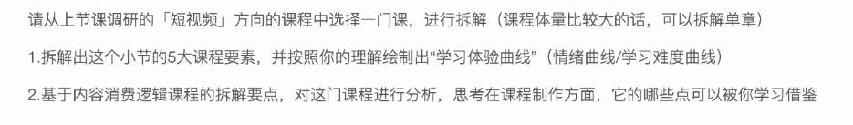

## 2022.7.6 日志

### 今日总结

- 上午

  - 基础面试题 6 道，输出自己的理解，练习了口头表达，并上传 GitHub 

    - 包括：Java 特点、JVM JDK JRE 区别、字节码及其好处、Java 编译与解释并存、Oracle JDK & OpenJDK、Java 和 C++ 区别

- 晚上

  - 腾讯会议解决一个同学的问题

    稍显慌张，虽然解答了问题，但总觉得做得不够。

### 明日计划

- 知识付费产品作业
- 朋友圈广告运营实训复盘
- 面试题
- 上午
  - 面试题：Java 基础常见知识 & 面试题总结（上）基本语法部分 6 题，并温习前 6 道题
- 下午
  - 朋友圈广告运营实训复盘
    - 简历撰写
    - 复盘视频
  - 有氧 1 h
- 晚上
  - 知识付费产品任务完成

